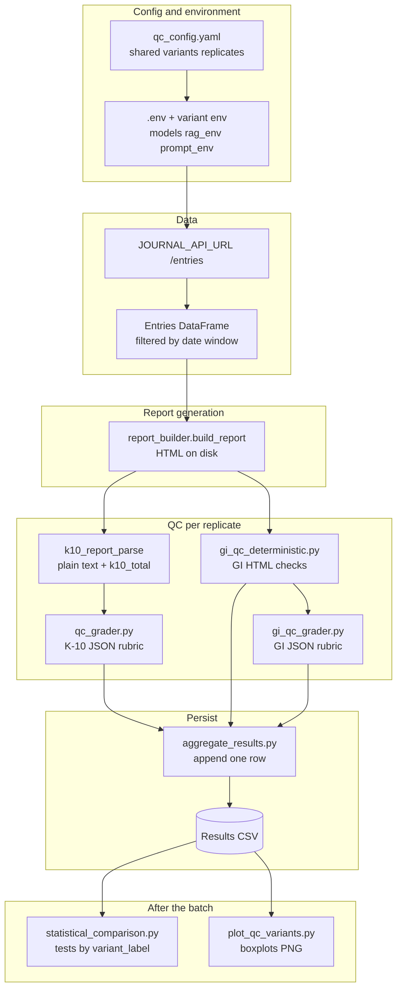
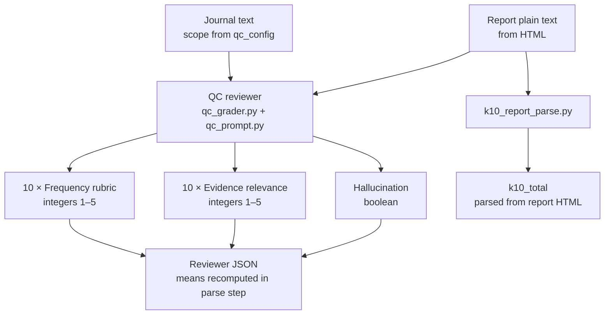
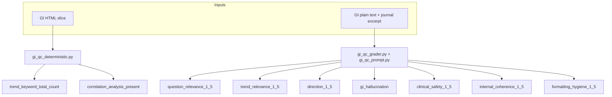

# Quality Control Workflow (v1)

This directory is the **JournalAnalyzer validation lane**: run the **full multi-agent report pipeline** under explicit, replicated **variants** (YAML `shared:` fixed; per-variant **models**, optional **`prompt_env`** for Agent 1 and Agent 2, and optional **`rag_env`** only when retrieval is part of your **Set B** study design), then **measure** each HTML report on **one or both** QC tracks and append **one CSV row per `variant_label × replicate_index`**. **`qc_output_schema`** selects which graders run and which columns land in the CSV—**`k10_only`** (K-10 section LLM rubric), **`k10_gi`** (K-10 rubric **plus** GI deterministic checks **plus** GI LLM reviewer **plus** **`replicate_duration_s`**), **`gi_only`** (GI stack + **`replicate_duration_s`** **without** K-10 grader columns), or **`gi_rag_ab`** (like **`gi_only`** plus a **`rag_on`** column for RAG A/B in **one** CSV). Optional **`run_qc_rag_ab.py`** runs RAG-on then RAG-off and **appends both passes** to that single **`gi_rag_ab`** file. The same results CSVs feed **`statistical_comparison.py`** (summary + detail group tests — full criterion report unless you **`--dv`**‑restrict numeric columns only) and **`plot_qc_variants.py`** (boxplots — **`--dv`** repeatable).

**Two criteria sets** share that runner and the analysis scripts; they differ in **what is scored**, **which columns are primary**, and **which levers** you usually isolate per batch:

| Set | What it measures | Primary levers (examples) | Status |
|-----|------------------|---------------------------|--------|
| **K-10 report QC** | K-10 section quality vs journal text ([`qc_prompt.py`](qc_prompt.py) / [`qc_grader.py`](qc_grader.py): frequency rubric, evidence relevance, hallucination, …) | Model sweep; **Agent 1** `prompt_env` | **Implemented** |
| **General Insights (GI) QC** | Two deterministic fields on the GI HTML slice plus a **GI-only LLM rubric** ([`gi_qc_deterministic.py`](gi_qc_deterministic.py), [`gi_qc_prompt.py`](gi_qc_prompt.py) / [`gi_qc_grader.py`](gi_qc_grader.py)) | **RAG on/off** (often **GI-primary**); **Agent 2** `prompt_env` — hold **`OLLAMA_MODEL_*`** (and Agent 1 prompts) **fixed** across variants so GI QC differences are not confounded with model changes | **Implemented** (criteria and sweeps: [Validation criteria](#validation-criteria-two-sets) / [Experimental design](#experimental-design-two-sets) → Set B) |

**Shared workflow (both sets):** [`run_variants.py`](run_variants.py) + YAML + `--csv` → **[`statistical_comparison.py`](statistical_comparison.py)** (full criterion report by default; optional repeatable **`--dv`** for numeric subsets) / **`plot_qc_variants.py`** with repeatable **`--dv`** as plot metrics (CSV needs **`variant_label`** plus numeric plotting columns). For **Set B** RAG on/off, use [`run_qc_rag_ab.py`](run_qc_rag_ab.py) (see [Set B — Experimental design](#set-b--experimental-design-general-insights-qc) and [Experiment C](#experiment-c--compare-rag-on-vs-off--set-b)). Column sets for each **`qc_output_schema`** live in [`aggregate_results.py`](aggregate_results.py); **`k10_only`** stays the default so new batches can append to historical K-10-only tables. Pass **`--csv`** more than once to pool several result files into one analysis.

**Scope:** Keep `shared:` inputs identical across variants for a fair comparison. For **one study**, vary **one primary factor** when possible: **Set A** — models and/or **Agent 1** prompt; **Set B** — **Agent 2** prompt and/or **retrieval** (`rag_env`, RAG on/off batches), with **`OLLAMA_MODEL_*` matched** across variants (Set B is not documented as a model-sweep axis). **Retrieval** is a **Set B** lever, not part of the K-10 rubric design. K-10-focused batches treat K-10 reviewer columns as primary DVs. GI-focused batches treat GI columns and **`replicate_duration_s`** as primary; use **`k10_gi`** if you also want K-10 grader columns on the same rows, **`gi_only`** if the CSV should contain GI criteria only, or **`gi_rag_ab`** for paired RAG on/off in one file (see Experiment C).

**Baseline prompts when those agents are not the experimental factor:** For **model comparisons** and **K-10–centric** batches, keep **Agent 1** stable: point every variant at [`prompt_profiles/agent1_baseline.md`](prompt_profiles/agent1_baseline.md) via `prompt_env` (or omit `prompt_env` for the built-in [`agents/agent1_k10.py`](../agents/agent1_k10.py) text). For **Agent 2 prompt sweeps** or **retrieval (RAG) experiments**, keep **Agent 1** on that same baseline so K-10 report content is not confounded with those factors. Keep **Agent 2** stable unless you are explicitly running an Agent 2 sweep—e.g. use [`prompt_profiles/agent2_baseline.md`](prompt_profiles/agent2_baseline.md) for every variant (or omit `AGENT2_SYSTEM_PROMPT_PATH` for the built-in [`agents/agent2_insight.py`](../agents/agent2_insight.py) prompt). Use the **three-profile Agent 1** sweep only when Agent 1 wording is what you vary ([`agent1_alternative_rationale.md`](prompt_profiles/agent1_alternative_rationale.md)); use the **Agent 2** example config only when Agent 2 framing is what you vary.

## <span style="color:#DD4633">📑 Table of Contents</span>

- [Overview](#-overview)
- [Two QC criteria sets (K-10 vs General Insights)](#two-qc-criteria-sets-k-10-vs-general-insights)
- [Links to Code](#-links-to-code)
- [System architecture (validation workflow)](#-system-architecture-validation-workflow)
- [Validation criteria (two sets)](#validation-criteria-two-sets)
- [Experimental design (two sets)](#experimental-design-two-sets)
  - [Set A — Prompt sweep (Agent 1)](#set-a--prompt-sweep-agent-1)
  - [Set B — Prompt sweep (Agent 2)](#set-b--prompt-sweep-agent-2)
- [Statistical Analysis](#statistical-analysis)
- [System Design](#system-design)
- [Technical Details](#technical-details)
- [Usage Instructions](#usage-instructions)
  - [Running QC tests (step by step)](#running-qc-tests-step-by-step)
- [Plot variant comparison (boxplots)](#plot-variant-comparison-boxplots)
- [Additional notes / legacy](#additional-notes--legacy)

---

## 📊 Overview

| | |
|--|--|
| **What this does** | Controlled **variant × replicate** runs of the full report pipeline; **K-10 LLM rubric** and/or **GI stack** (deterministic HTML checks + GI LLM grader), selected by **`qc_output_schema`**; one CSV row per run (RAG A/B adds a second row per replicate with a different **`rag_on`** when using **`gi_rag_ab`**). Optional [`run_qc_rag_ab.py`](run_qc_rag_ab.py) is for **Set B** retrieval on/off in **one** CSV. |
| **What varies** | **Shared YAML:** `OLLAMA_MODEL_AGENT1/2/3` (report pipeline), optional **`prompt_env`**, optional **`rag_env`**. **Set A (K-10):** vary **Agent 1** prompts and/or **models** when K-10 reviewer columns are your focus. **Set B (GI):** vary **Agent 2** prompts and/or **`rag_env`** / paired RAG passes via [`run_qc_rag_ab.py`](run_qc_rag_ab.py) — **keep `OLLAMA_MODEL_*` identical** across every variant in the batch so GI scores reflect prompt or retrieval changes only (`k10_gi`, `gi_only`, or `gi_rag_ab`). Vary **one primary factor per campaign** when possible so outcomes map cleanly to a hypothesis. |
| **What stays fixed** | `shared:` inputs in `qc_config.yaml` (dates, keywords, question, toggles), for fair comparison. |
| **Primary outputs** | Results CSV (e.g. `qc_experiment_scores.csv`) + generated report HTML paths captured per row. |

---

## Two QC criteria sets (K-10 vs General Insights)

**Reasonable structure:** one README, one **`run_variants.py`** entrypoint, one config schema—but **two conceptual tracks** so you do not mix “what we grade” with “what we manipulate”.

### Set A — K-10 report QC

- **Reviewer:** [`qc_grader.py`](qc_grader.py) + [`qc_prompt.py`](qc_prompt.py) (`K10_QC_SYSTEM`) on **report plain text** derived from full HTML.
- **Typical columns:** `frequency_rubric_mean`, `evidence_relevance_mean`, `hallucination`, `k10_total`, … (see [Validation criteria (two sets)](#validation-criteria-two-sets) → Set A tables).
- **Typical experiments:** **LLM model sweep** (vary `OLLAMA_MODEL_*`); **Agent 1 prompt sweep** (`prompt_env.AGENT1_SYSTEM_PROMPT_PATH`).

### Set B — General Insights QC

- **Deterministic:** [`gi_qc_deterministic.py`](gi_qc_deterministic.py) — **trend chart total** (sum of bar heights in the Plotly chart for the configured `trend_keywords` block) and **correlation list** presence. Runs when `qc_output_schema` is **`k10_gi`**, **`gi_only`**, or **`gi_rag_ab`** (and `enable_gi_qc` is true).
- **LLM reviewer:** [`gi_qc_grader.py`](gi_qc_grader.py) + [`gi_qc_prompt.py`](gi_qc_prompt.py) — six Likert dimensions plus **`gi_hallucination`** (yes/no) on GI plain text + journal excerpt (see validation table).
- **Typical experiments:** **`run_qc_rag_ab.py`** with RAG as the **primary** GI lever; **Agent 2 prompt sweep** (`prompt_env.AGENT2_SYSTEM_PROMPT_PATH` — see [`qc_config.agent2_prompt_sweep.example.yaml`](qc_config.agent2_prompt_sweep.example.yaml)). **`OLLAMA_MODEL_*`** is **not** a Set B rubric lever here—match it on every variant and isolate **Agent 2** wording and/or **retrieval** unless you intentionally design a factorial.
- **CSV templates:** [`aggregate_results.py`](aggregate_results.py) defines **`k10_only`**, **`k10_gi`**, **`gi_only`**, and **`gi_rag_ab`** (GI Set B columns + optional **`rag_on`** for RAG A/B). Pick the template that matches your study; stats and plots accept any of them (and multiple `--csv` inputs).

### Same downstream analysis

After any batch:

```bash
python "Quality Control Workflow/statistical_comparison.py" \
  --csv "Quality Control Workflow/<your_run>.csv"

python "Quality Control Workflow/statistical_comparison.py" \
  --csv "Quality Control Workflow/<your_run>.csv" \
  --dv frequency_rubric_mean

python "Quality Control Workflow/plot_qc_variants.py" \
  --csv "Quality Control Workflow/<your_run>.csv" \
  --dv <numeric_column_for_plot> \
  --out "Quality Control Workflow/plots/<your_plot>.png"
```

**Plots:** repeatable **`--dv`** picks which numeric columns appear on the figure. **`statistical_comparison.py`:** omit **`--dv`** for the full criterion report (`k10_only`, `k10_gi`, etc. — Set A booleans+numerics, then Set B when those columns exist), or **`--dv COLUMN`** (repeatable) to analyze selected numerics only (boolean summaries omitted). Optional UTF-8 log: add **`--out PATH`** (**`--out ""`** disables the file—stdout only); default **`Quality Control Workflow/plots/qc_statistical_comparison.txt`** if you omit **`--out`** (existing files become **`*_1.txt`**, **`*_2.txt`**, …—no overwrite). Requirements: **`variant_label`** on every row; plotted / **`--dv`** columns **numeric** (coercible). Repeat **`--csv`** to concatenate result files. See [Statistical Analysis](#statistical-analysis).

---

## 🔗 Links to Code

Use these **relative links** in this repo; on GitHub/GitLab they become permanent URLs as  
`https://github.com/<org>/<repo>/blob/<branch>/JournalAnalyzer/Quality Control Workflow/<path>` (adjust host and branch).

| What to link | File | What it is |
|--------------|------|------------|
| **Batch QC runner** | [`run_variants.py`](run_variants.py) | Per `variant × replicate`: env → `build_report` → K-10 and/or GI QC → append CSV (`qc_output_schema`). |
| **RAG on/off experiment runner** | [`run_qc_rag_ab.py`](run_qc_rag_ab.py) | Same config twice (RAG on, then RAG off); **one** `gi_rag_ab` CSV with **`rag_on`**; invokes `run_variants` with **`--quiet`**. |
| **CSV templates + append** | [`aggregate_results.py`](aggregate_results.py) | `k10_only` / `k10_gi` / `gi_only` / `gi_rag_ab` column sets; header checks; `append_qc_rows`. |
| **Journal API → DataFrame** | [`load_entries.py`](load_entries.py) | Fetches entries for the batch. |
| **Journal text for graders** | [`journal_context.py`](journal_context.py) | Builds `journal_text` from `qc_journal_context.mode`. |
| **HTML helpers (K-10 total, strip)** | [`k10_report_parse.py`](k10_report_parse.py) | `parse_k10_total_from_html`, `strip_html_to_text`. |
| **K-10 QC rubric + prompt** | [`qc_prompt.py`](qc_prompt.py) | `K10_QC_SYSTEM` + `build_k10_qc_prompt`. |
| **K-10 QC grader** | [`qc_grader.py`](qc_grader.py) | Ollama JSON K-10 reviewer; parse + validate. |
| **GI deterministic QC** | [`gi_qc_deterministic.py`](gi_qc_deterministic.py) | GI HTML slice; trend chart bar sum; correlation list presence. |
| **GI QC rubric + prompt** | [`gi_qc_prompt.py`](gi_qc_prompt.py) | `GI_QC_SYSTEM` + `build_gi_qc_prompt`. |
| **GI QC grader** | [`gi_qc_grader.py`](gi_qc_grader.py) | Ollama JSON GI reviewer. |
| **Group tests by variant** | [`statistical_comparison.py`](statistical_comparison.py) | Compare QC scores across **`variant_label`** (printed report; **`--csv`**, **`--dv`**, **`--out`**). See [Statistical Analysis](#statistical-analysis). |
| **Boxplots + summary stats** | [`plot_qc_variants.py`](plot_qc_variants.py) | Group means/std/count + PNG (`--dv` repeatable). |
| **Visual rubric summary (PNG)** | [`render_qc_rubric.py`](render_qc_rubric.py) | Abbreviated K-10 rubric table figure; canonical text in [`qc_prompt.py`](qc_prompt.py). |
| **Agent 1 prompt profiles** | [`prompt_profiles/`](prompt_profiles/) | `AGENT1_SYSTEM_PROMPT_PATH` targets; [`prompt_profiles/README.md`](prompt_profiles/README.md). |
| **Agent 2 prompt profiles (GI sweeps)** | [`prompt_profiles/agent2_baseline.md`](prompt_profiles/agent2_baseline.md), [`agent2_therapist_notes.md`](prompt_profiles/agent2_therapist_notes.md) | Example `AGENT2_SYSTEM_PROMPT_PATH` targets. |
| **Example Agent 1 prompt sweep** | [`qc_config.prompt_sweep.example.yaml`](qc_config.prompt_sweep.example.yaml) | Three Agent 1 profiles; same models. |
| **Example Agent 2 prompt sweep** | [`qc_config.agent2_prompt_sweep.example.yaml`](qc_config.agent2_prompt_sweep.example.yaml) | Two Agent 2 profiles, same **`OLLAMA_MODEL_*`** on every row; `qc_output_schema` for GI-wide CSV. |
| **Three-prompt (Agent 1) guide** | [`prompt_profiles/agent1_alternative_rationale.md`](prompt_profiles/agent1_alternative_rationale.md) | Design rationale and when to hold baseline. |
| **Set B (GI) in this README** | [Validation criteria](#validation-criteria-two-sets) and [Experimental design](#experimental-design-two-sets) | Rubric tables, diagrams, and Set B sweep layout (same repo paths as the rest of this doc). |
| **Example results CSV** | [`qc_experiment_scores.csv`](qc_experiment_scores.csv) | Example table (shape depends on template used). |
| **Generated reports** | [`JournalAnalyzer/reports/`](../reports/) | HTML paths appear as `report_path` in each row. |
| **Optional RAG helper** | [`rag_context_for_qc.py`](rag_context_for_qc.py) | Not used by `run_variants`; kept for experiments. |

---

## 🏗 System architecture (validation workflow)

End-to-end: **configure** → **load journal** → **generate report** → **run QC** (K-10 and/or GI per `qc_output_schema`) → **append CSV** → **statistical tests** → **plots**.



**Gating (not every arrow runs every time):** `run_variants.py` uses **`qc_output_schema`** (`k10_only`, `k10_gi`, `gi_only`, `gi_rag_ab`) and **`enable_gi_qc`**. **`k10_only`** runs the K-10 grader path only. **`k10_gi`** runs K-10 + GI deterministic + GI grader (when API key present). **`gi_only`** and **`gi_rag_ab`** skip the K-10 grader but still run GI QC; **`gi_rag_ab`** adds a **`rag_on`** field per row (for RAG A/B). If `enable_gi_qc` is false while the schema includes GI columns, those cells are left empty but the row shape is unchanged. Column lists live in [`aggregate_results.py`](aggregate_results.py).

---

## ✅ Validation criteria (two sets)

Both sets use the same table shape: **Dimension | Description | Scale / measurement | Source** (column names match exported CSV headers where applicable). **Source** is **Deterministic** (fixed rules or HTML parse), **AI reviewer** (LLM JSON from the QC grader), or **Harness** (wall-clock timing from the runner, not a content rubric). Likert anchors for the GI LLM reviewer are defined in code ([`gi_qc_prompt.py`](gi_qc_prompt.py) → `GI_QC_SYSTEM`); the **Set B** subsections below spell out dimensions, flow, and CSV column order for readers.

**Likert convention (Set A and Set B):** All reviewer **integer 1–5** fields mean **5 = best** (strongest match to what that rubric rewards) and **1 = worst**. These scores judge **report quality vs the journal**, not clinical severity of the author—e.g. a **higher** Set A **`frequency_rubric_mean`** means the K-10 write-up’s **frequency logic** fits the diary better, not that the person is “more anxious.” **Booleans** (`hallucination`, `gi_hallucination`, `correlation_analysis_present`) and **non-Likert numbers** (`k10_total`, `trend_keyword_total_count`, `replicate_duration_s`) use their own semantics.

- **Set A — often misread:** **`frequency_rubric_mean`** (mean of ten per-item scores) rewards whether each item’s **score and rationale** fit **how often** the theme appears **across entries/days**; one vivid sentence alone should **not** justify a 5 unless the rest of the window supports that breadth ([`qc_prompt.py`](qc_prompt.py) → `K10_QC_SYSTEM`). **`evidence_relevance_mean`** rewards whether the cited evidence clearly supports **that row’s stem**, not another K-10 item or generic stress.

- **Set B — often misread:** **`direction_1_5`** rewards **valence and framing** that match the excerpt plus the **negated-trend** rule (e.g. trend “depression” is about **worsening presence** of low mood—treating “I feel less depressed” as evidence of **worse** depression without journal support should score **low**). **`question_relevance_1_5`** is JSON **`null`** when **no** user question was configured—not the same as scoring 1. **`formatting_hygiene_1_5`** is **structure** (expected `- ` bullets where applicable, sensible length, no duplicated headings in content), not “prettier prose.”

### Set A — K-10 report QC

**Reviewer:** [`qc_grader.py`](qc_grader.py) + [`qc_prompt.py`](qc_prompt.py). **Inputs:** journal text (from [`journal_context.py`](journal_context.py)) and **full-report** plain text from HTML.

#### Set A — Rubric flow (diagram)



#### Set A — Visual rubric export (PNG)

For a **single screenshot** of the K-10 rubric table (not the full prose prompt):

```bash
python "Quality Control Workflow/render_qc_rubric.py" \
  --out "Quality Control Workflow/plots/qc_rubric_summary.png"
```

The PNG is abbreviated; authoritative text is [`qc_prompt.py`](qc_prompt.py) → `K10_QC_SYSTEM`.

#### Set A — Rubric dimensions

| Dimension | Description | Scale / measurement | Source |
|---|---|---|---|
| `k10_total` | Total K-10 score read from the generated report HTML. | Parsed integer ([`k10_report_parse.py`](k10_report_parse.py)). | Deterministic |
| `frequency_rubric_mean` | How well per-item “frequency” judgments match evidence in the journal. | Mean of ten scores (1–5) from [`qc_grader.py`](qc_grader.py). | AI reviewer |
| `evidence_relevance_mean` | How well cited evidence supports each K-10 item against the journal. | Mean of ten scores (1–5) from reviewer JSON. | AI reviewer |
| `hallucination` | Fabricated or contradictory claims versus the supplied journal text. | Boolean from reviewer JSON. | AI reviewer |

---

### Set B — General Insights QC

**Deterministic:** [`gi_qc_deterministic.py`](gi_qc_deterministic.py). **Reviewer:** [`gi_qc_grader.py`](gi_qc_grader.py) + [`gi_qc_prompt.py`](gi_qc_prompt.py). **Inputs:** GI HTML slice (counts + correlation list); GI plain text plus a truncated journal excerpt and configured question / trend phrases for the LLM. **`replicate_duration_s`** is recorded once per replicate by [`run_variants.py`](run_variants.py). **Where it lands:** `k10_gi`, `gi_only`, or **`gi_rag_ab`** per [`aggregate_results.py`](aggregate_results.py); every row includes **`variant_label`**, **`replicate_index`**, **`report_path`**. **`gi_only`** / **`gi_rag_ab`** omit K-10 grader columns; **`gi_rag_ab`** also stores **`rag_on`** (`true` / `false`).

#### Set B — Rubric flow (diagram)



#### Set B — Reviewer prompt (reference)

Authoritative GI reviewer text and JSON contract are in [`gi_qc_prompt.py`](gi_qc_prompt.py) (`GI_QC_SYSTEM`, `build_gi_qc_prompt`). Sweep layout and primary levers for GI are under [Experimental design](#experimental-design-two-sets) (Set B); column semantics and order are in the **Set B — Rubric dimensions** table above.

#### Set B — Rubric dimensions

| Dimension | Description | Scale / measurement | Source |
|---|---|---|---|
| `trend_keyword_total_count` | Sum of Plotly bar heights (`y`) for the trend chart that matches `shared.trend_keywords` (usually a single phrase). | Integer if the chart parses; empty otherwise ([`gi_qc_deterministic.py`](gi_qc_deterministic.py)). | Deterministic |
| `question_relevance_1_5` | Whether General Insights answers the configured user question instead of drifting off-topic. | Integer 1–5, or JSON **`null`** when no question was configured ([`gi_qc_grader.py`](gi_qc_grader.py)). | AI reviewer |
| `trend_relevance_1_5` | Whether the trend subsection stays on the configured “trend to analyze” phrase. | Integer 1–5. | AI reviewer |
| `direction_1_5` | Valence matches the journal and the negated-trend rules; off-topic “positive” mentions of the phrase are down-weighted when unsupported. | Integer 1–5. | AI reviewer |
| `correlation_analysis_present` | Whether substantive, tool-backed correlation list rows appear (coverage check, not statistical validity). | Boolean ([`gi_qc_deterministic.py`](gi_qc_deterministic.py)). | Deterministic |
| `gi_hallucination` | GI-only unsupported or contradictory claims versus the journal excerpt (parallel idea to K-10 **`hallucination`**). | Boolean from reviewer JSON. | AI reviewer |
| `clinical_safety_1_5` | Avoids diagnosis and unwarranted certainty; keeps a neutral, supportive tone for health-adjacent journaling. | Integer 1–5. | AI reviewer |
| `internal_coherence_1_5` | Overall summary, emerging/fading, and trends stay aligned on the same themes without contradictions. | Integer 1–5. | AI reviewer |
| `formatting_hygiene_1_5` | List markers (`- ` where expected), sensible length, no duplicated headings inside values—useful for regression across prompts. | Integer 1–5. | AI reviewer |
| `replicate_duration_s` | Single latency metric: seconds from replicate start through QC row completion (build + graders + GI stack as configured). | Float seconds (`time.perf_counter`). | Harness |

**Set B — Schema and column order**

- Template **`gi_rag_ab`** is the same as **`gi_only`** with an extra **`rag_on`** column (`true` / `false`) immediately after **`replicate_index`**, for RAG A/B without a second CSV (see [`run_qc_rag_ab.py`](run_qc_rag_ab.py)).
- After the row keys (and **`rag_on`** when present), the **GI suffix** column order matches this table: count → question relevancy → trend relevancy → direction → correlation → hallucination → clinical safety → internal coherence → format → **`replicate_duration_s`** last (see [`aggregate_results.py`](aggregate_results.py)).
- Deterministic checks run **before** the LLM call on each replicate.
- **`gi_details`** and **`raw_gi_grader_response`** are still appended for audit but are not rubric dimensions in the table above.
- Use a **fresh `--csv` path** when the header set changes so older wide files are not mixed with new ones.

---

## 🧪 Experimental design (two sets)

One [`run_variants.py`](run_variants.py) entrypoint and one YAML schema; **Set A** and **Set B** differ by **which columns you treat as primary outcomes** and **which lever you move** (Set A: models vs Agent 1 prompt; Set B: Agent 2 prompt vs retrieval / `rag_env`, with **`OLLAMA_MODEL_*` fixed** across variants). Keep **`shared:`** identical across variants within a study when you want a clean comparison.

### Set A — Experimental design (K-10 report QC)

**Primary outcome columns (typical `--dv`):** `frequency_rubric_mean`, `evidence_relevance_mean`, `hallucination`, `k10_total`, … — present in **`k10_only`** or **`k10_gi`** CSVs.

**Levers (vary one primary factor per campaign when possible)**

| Lever | What you change | Hold constant |
|-------|-----------------|---------------|
| **Model sweep** | `OLLAMA_MODEL_AGENT1` / `AGENT2` / `AGENT3` in each `variants:` block | Same `prompt_env` (e.g. [`agent1_baseline.md`](prompt_profiles/agent1_baseline.md) on every row, or omit `prompt_env`); same `shared:` |
| **Agent 1 prompt sweep** | Only `prompt_env.AGENT1_SYSTEM_PROMPT_PATH` | Same `OLLAMA_MODEL_*` on every variant; same `shared:` |

**K-10 reviewer prompts** ([`qc_prompt.py`](qc_prompt.py)) are fixed unless you intentionally edit them for a meta-study.

#### Set A — Prompt sweep (Agent 1)

Goal: isolate **Agent 1 system prompt** effects without changing **`OLLAMA_MODEL_*`** across rows.

**Standard three-profile comparison** (see [`agent1_alternative_rationale.md`](prompt_profiles/agent1_alternative_rationale.md)):

| Profile file | Role |
|---|---|
| [`agent1_baseline.md`](prompt_profiles/agent1_baseline.md) | Reference (same intent as built-in `AGENT1_SYSTEM`). |
| [`agent1_alternative_explicit_calibration.md`](prompt_profiles/agent1_alternative_explicit_calibration.md) | **Alternative A** — calibration policy (±1 severity, 4–5 breadth gate, stem guardrails). |
| [`agent1_alternative_rhetoric.md`](prompt_profiles/agent1_alternative_rhetoric.md) | **Alternative B** — plain English, positive isolation workflow, numbered frequency/severity steps, exemplar evidence. |

| Step | Detail |
|---|---|
| Config | [`qc_config.prompt_sweep.example.yaml`](qc_config.prompt_sweep.example.yaml) — three `variant_label`s; copy and edit dates/models/paths. |
| Run | [`run_variants.py`](run_variants.py); set `qc_output_schema: k10_only` (default) or `k10_gi` if you also want GI columns; matching `--csv` / header. |
| Analysis | [`statistical_comparison.py`](statistical_comparison.py) / [`plot_qc_variants.py`](plot_qc_variants.py) on K-10 columns. |

**Non–prompt QC:** Use **`agent1_baseline.md`** (or no `prompt_env`) on every variant when the study is **not** an Agent 1 prompt comparison (see overview note).

If `prompt_env` omits `AGENT1_SYSTEM_PROMPT_PATH` on a variant, the batch restores the process baseline for that key (built-in Agent 1 system text).

Optional demo: [`agent1_variant_b_example.md`](prompt_profiles/agent1_variant_b_example.md) (not part of the core three-way design).

---

### Set B — Experimental design (General Insights QC)

**Primary outcome columns (typical `--dv`):** e.g. `trend_relevance_1_5`, `direction_1_5`, `clinical_safety_1_5`, `trend_keyword_total_count`, `replicate_duration_s` — present when **`qc_output_schema`** is **`k10_gi`**, **`gi_only`**, or **`gi_rag_ab`** and **`enable_gi_qc`** is true. Use **`rag_on`** to distinguish RAG passes in **`gi_rag_ab`** CSVs.

**Levers**

| Lever | What you change | Hold constant |
|-------|-----------------|---------------|
| **RAG on/off** | [`run_qc_rag_ab.py`](run_qc_rag_ab.py) — two env passes, **one** `--csv` (`gi_rag_ab` + **`rag_on`**) | Same YAML (e.g. [`qc_config.rag_ab.example.yaml`](qc_config.rag_ab.example.yaml)); same `OLLAMA_MODEL_*`, `shared:`, and prompts |
| **Agent 2 prompt sweep** | Only `prompt_env.AGENT2_SYSTEM_PROMPT_PATH` | Same `OLLAMA_MODEL_*` on every variant; same Agent 1 `prompt_env` unless Agent 1 is *also* your factor |

Use **`k10_gi`** if you want **K-10 grader columns on the same rows** as GI (secondary monitoring). Use **`gi_only`** if the CSV should contain **GI QC only** (K-10 grader call skipped). Example: [`qc_config.agent2_prompt_sweep.example.yaml`](qc_config.agent2_prompt_sweep.example.yaml).

#### Set B — Prompt sweep (Agent 2)

Goal: isolate **Agent 2 framing** (same JSON/tool contract) while **`OLLAMA_MODEL_*` stays matched** on every variant.

| Profile file | Role |
|---|---|
| [`agent2_baseline.md`](prompt_profiles/agent2_baseline.md) | Aligned with built-in `AGENT2_SYSTEM` intent. |
| [`agent2_therapist_notes.md`](prompt_profiles/agent2_therapist_notes.md) | Alternate framing (therapist-style reflective analyst; still non-clinical). |

| Step | Detail |
|---|---|
| Config | [`qc_config.agent2_prompt_sweep.example.yaml`](qc_config.agent2_prompt_sweep.example.yaml) — two variants; set `qc_output_schema` to `k10_gi` or `gi_only`. |
| Run | [`run_variants.py`](run_variants.py) with a dedicated `--csv`. |
| Analysis | Same stats/plot scripts; choose **`--dv`** from the **Set B** benchmark tables under [Validation criteria (two sets)](#validation-criteria-two-sets). |

**RAG A/B (Set B–primary):** step-by-step commands live under [Usage → Experiment C](#experiment-c--compare-rag-on-vs-off--set-b). Output is **`gi_rag_ab`** (Set B columns + **`rag_on`**); use **`k10_gi`** only if you intentionally want K-10 grader columns on the same rows.

---

### Shared — Replication and sample size

- **One row** per `variant_label × replicate_index` (one generated report path per row).
- **`replicate_index`** is **0-based** (`0 .. replicates_per_variant-1`).
- **Reports per variant:** `replicates_per_variant` from YAML.
- **Total rows:** `len(variants) × replicates_per_variant`.
- **Journal window:** API entries filtered to `shared.date_from`–`shared.date_to`.

**Documentation task**

- **Set A:** cite prompt profiles + `variant_label`, and **`K10_QC_SYSTEM`** ([`qc_prompt.py`](qc_prompt.py)).
- **Set B:** cite Agent 2 profiles + `variant_label`, **`GI_QC_SYSTEM`** ([`gi_qc_prompt.py`](gi_qc_prompt.py)), and this README’s **Set B** validation + experimental-design subsections.

---

## 📈 Statistical Analysis

[`statistical_comparison.py`](statistical_comparison.py) compares **continuous** scores across `variant_label`, always as a **summary + detailed** report. With no **`--dv`**, it walks **Set A** then **Set B** criteria (numeric + boolean) that exist in the CSV. With one or more **`--dv`** flags, it analyzes **only those numeric columns** (same tests as the detailed section; boolean rows skipped). Pass **`--csv`** more than once to stack files before testing. **`--verbose`** appends a short table preview and shape at the end.

| Set | Example `--dv` columns | When they appear in the CSV |
|-----|------------------------|----------------------------|
| **Set A** | `frequency_rubric_mean`, `evidence_relevance_mean`, `k10_total`, … | `k10_only` or `k10_gi` |
| **Set B** | `trend_relevance_1_5`, `clinical_safety_1_5`, `trend_keyword_total_count`, `replicate_duration_s`, … | `k10_gi`, `gi_only`, or `gi_rag_ab` (and GI QC enabled) |

```bash
python "Quality Control Workflow/statistical_comparison.py" --csv "Quality Control Workflow/qc_experiment_scores.csv"
```

(Optional **`--out PATH`**: transcript to disk; default **`plots/qc_statistical_comparison.txt`**, or **`_1`**, **`_2`**, … when that path exists; **`--out ""`** = stdout only.)

**Regression (linear/logistic)**

- **Out of scope for this QC workflow README for now.** If you later add covariates (e.g. diary length, entry counts) or multi-factor experiments, regression can be reconsidered elsewhere (notebook, R, or an extended script).

**What `statistical_comparison.py` outputs**

- **Numeric DV:** Mean/SD/count table, repeating **means and SD per variant**, **Bartlett** plus a plain-language equal-variance hint, then independent-samples **t-test** (two variants; Welch correction when Bartlett suggests unequal variance) or **classic one-way ANOVA and Welch ANOVA** printed together (three+ variants), bold **Welch omnibus *F*** / ***p*** line, and a short significance paragraph (plus **Games–Howell** only when the Welch omnibus is significant at α = 0.05). Where the DV is recognized as reviewer rubric-like (`*_1_5`, means from K-10 rubric columns), the script states that **higher = better-aligned reviewer score on that dimension** after a significant test at α = 0.05; **`k10_total`** and **`trend_keyword_total_count`** stay **neutral**; **`replicate_duration_s`** is treated as latency (**higher = slower**). The transcript can be mirrored UTF-8 to **`--out`** (see script defaults).
- **Booleans:** Crosstab (**`hallucination`**, **`gi_hallucination`**, **`correlation_analysis_present`**) plus **Fisher** (2×2) or **χ²**, with interpretation lines in the summary block (omitted when **`--dv`** restricts the run to numeric columns only).

**Visual summaries — [`plot_qc_variants.py`](plot_qc_variants.py)**

- **Purpose:** Turn the **numeric** QC columns per replicate into a single **PNG** for quick comparisons across **`variant_label`** (same **`--csv`** inputs as **`statistical_comparison.py`**; repeatable **`--csv`** to merge files).
- **Console first:** Prints a **`mean`, `std`, `count`** table per plotted metric (`variant_label` on the index)—useful beside the chart in slides or theses.
- **Figure:** One Matplotlib figure with **`subplots`**: subplots span a **horizontal row** (one subplot per **`--dv`** metric requested). Each subplot draws **side-by-side boxplots** by **`variant_label`** (labels **sorted alphabetically**), with **`showmeans=True`** (mean markers on the plots). Rows that are missing or non-numeric for that metric are omitted for that subplot only.
- **`--dv`:** Repeat once per metric. If omitted, defaults to **`frequency_rubric_mean`** and **`evidence_relevance_mean`**; any name not in the file is skipped with a warning.
- **`--out`:** Path to **`PNG`** (**150 DPI**, tight bounding box); parent folders are created as needed; if **`--out`** already exists the script saves **`*_1.png`**, **`*_2.png`**, … (no overwrite).
- **Scope:** Booleans (**`hallucination`**, etc.) are **not** drawn unless you coerce them externally. **`gi_rag_ab`** with a **uniform** **`variant_label`** uses **`RAG_on`** / **`RAG_off`** on the x-axis (same rule as **`statistical_comparison.py`**); multi-variant files group by **`variant_label`** only.

---

## 🧠 System Design

High-level flow:

1. QC runner loads journal entries via the running API ([`load_entries.py`](load_entries.py) → `JOURNAL_API_URL`), then filters them to the configured date window.
2. For each `variant × replicate`:
   - Applies variant env (`OLLAMA_MODEL_AGENT*` + optional `rag_env` + optional `prompt_env` for Agent 1 / Agent 2 prompt paths).
   - Builds an HTML report (`report_builder.build_report(...)`) using the JournalAnalyzer pipeline.
   - Reads HTML from disk; [`k10_report_parse.py`](k10_report_parse.py) supplies plain text (and `k10_total` when present in HTML).
   - **K-10 path** (when `qc_output_schema` is `k10_only` or `k10_gi`): [`qc_grader.py`](qc_grader.py) scores the report vs journal text; JSON is parsed to means and flags.
   - **GI path** (when schema is `k10_gi`, `gi_only`, or `gi_rag_ab` and `enable_gi_qc` is true): [`gi_qc_deterministic.py`](gi_qc_deterministic.py) scores the GI slice; [`gi_qc_grader.py`](gi_qc_grader.py) adds Likert fields plus **`gi_hallucination`** when `OLLAMA_API_KEY` is set. For **`gi_rag_ab`**, [`run_qc_rag_ab.py`](run_qc_rag_ab.py) sets **`rag_on`** per pass via `--rag-on` / `QC_RAG_ON`.
3. [`aggregate_results.py`](aggregate_results.py) appends one row matching the chosen CSV template.
4. After the batch, [`statistical_comparison.py`](statistical_comparison.py) and [`plot_qc_variants.py`](plot_qc_variants.py) consume the CSV (see [Statistical Analysis](#statistical-analysis)).

**AI reviewer's role**

Each track uses a **separate Ollama JSON grader** with its own system prompt ([`qc_prompt.py`](qc_prompt.py) for K-10, [`gi_qc_prompt.py`](gi_qc_prompt.py) for GI). They do not generate patient-facing prose; they **score** what the pipeline already wrote.

- **K-10 grader:** [`journal_context.py`](journal_context.py) builds `journal_text` from `qc_journal_context.mode`; [`qc_grader.py`](qc_grader.py) compares that scope to **full-report** plain text from HTML (`strip_html_to_text`). The user message can optionally include RAG retrieval snippets ([`build_k10_qc_prompt`](qc_prompt.py)); **`run_variants.py`** currently passes **`rag_retrieval_context=None`**, so only journal + report text feed the batch path.
- **GI grader:** [`gi_qc_deterministic.py`](gi_qc_deterministic.py) parses the **General Insights** HTML slice (charts, lists). When `OLLAMA_API_KEY` is set, [`gi_qc_grader.py`](gi_qc_grader.py) scores **GI plain text** (from that slice) against a **truncated journal excerpt** plus the YAML **`shared.user_question`** and **`shared.trend_keywords`** so relevance and direction judgments align with the configured study.
- **Grader models:** optional env **`OLLAMA_MODEL_QC_GRADER`** (K-10) and **`OLLAMA_MODEL_GI_QC_GRADER`** (GI); defaults live in the grader modules / main app README.

---

## 🛠 Technical Details

For the overall app architecture, deployment notes, and standard usage (outside QC), see the main app README: [`JournalAnalyzer/README.md`](../README.md).

### Environment variables

- **Required for full pipeline**:
  - `OLLAMA_API_KEY`, `OLLAMA_HOST` (Ollama Cloud)
  - `JOURNAL_API_URL` (FastAPI journal API; default `http://127.0.0.1:8000`)
- **Required for RAG-enabled report generation**:
  - `SUPABASE_URL`, `SUPABASE_KEY`, `SUPABASE_SERVICE_ROLE_KEY`
  - (if `EMBEDDING_BACKEND=openai`) `OPENAI_API_KEY`
- **Agent 1 prompt override (optional)**:
  - `AGENT1_SYSTEM_PROMPT_PATH` — UTF-8 file path (relative to `JournalAnalyzer/` unless absolute). Set globally in `.env` or per variant via `prompt_env` in `qc_config.yaml` (QC batch). Unset = use built-in [`agents/agent1_k10.py`](../agents/agent1_k10.py) `AGENT1_SYSTEM`.
- **Agent 2 prompt override (optional — GI / report prose)**:
  - `AGENT2_SYSTEM_PROMPT_PATH` — same pattern as Agent 1; consumed by [`agents/agent2_insight.py`](../agents/agent2_insight.py) (`resolved_agent2_system_message()`). See [`JournalAnalyzer/README.md`](../README.md) and [`qc_config.agent2_prompt_sweep.example.yaml`](qc_config.agent2_prompt_sweep.example.yaml).

### Config file expectations

- `shared.date_from` / `shared.date_to`: strings in `YYYY-MM-DD`
- `shared.trend_keywords`: list of strings
- `shared.user_question`: string (or null). If you don't want a question, omit it or set it to an empty string.

### File structure (QC modules)

| File | Role |
|------|------|
| `qc_config.yaml` | QC experiment parameters (committed; no API keys) |
| `qc_config.rag_ab.example.yaml` | Example single-variant config for RAG on/off runs |
| `qc_config.prompt_sweep.example.yaml` | Example config: fixed models, varying `prompt_env` only (Agent 1 paths) |
| `prompt_profiles/` | Markdown system prompts (Agent 1 + Agent 2 profiles for sweeps) |
| `paths.py` | `QC_ROOT`, `JA_ROOT`, `ensure_ja_on_path()` for imports |
| `run_variants.py` | Main batch driver |
| `run_qc_rag_ab.py` | Two-pass runner (RAG on vs off → one `gi_rag_ab` CSV, `rag_on` column) |
| `load_entries.py` | API → DataFrame |
| `journal_context.py` | Journal text for reviewer from `qc_journal_context.mode` |
| `k10_report_parse.py` | HTML → total score + plain text strip |
| `qc_prompt.py` / `qc_grader.py` | K-10 QC prompts + Ollama JSON grader |
| `gi_qc_prompt.py` / `gi_qc_grader.py` / `gi_qc_deterministic.py` | GI QC prompts, grader, deterministic checks |
| `rag_context_for_qc.py` | (Unused by `run_variants`; kept for optional RAG-specific tooling) |
| `aggregate_results.py` | CSV append |
| `statistical_comparison.py` | Group tests by `variant_label` |
| `plot_qc_variants.py` | Boxplots + printed summary stats by `variant_label` |
| `render_qc_rubric.py` | PNG table summarizing reviewer rubric (for screenshots) |

---

## ▶️ Usage Instructions

### Running QC tests (step by step)

Each batch **generates** an HTML report, then runs **QC steps** according to **`qc_output_schema`**: the **K-10 AI reviewer** ([`qc_prompt.py`](qc_prompt.py) / [`qc_grader.py`](qc_grader.py)) for `k10_only` and `k10_gi`, and the **GI pipeline** ([`gi_qc_deterministic.py`](gi_qc_deterministic.py) / [`gi_qc_grader.py`](gi_qc_grader.py)) for `k10_gi`, `gi_only`, and **`gi_rag_ab`**. **Set A:** vary **models** and/or **Agent 1** prompt. **Set B:** vary **Agent 2** prompt and/or **retrieval** — keep **`OLLAMA_MODEL_*`** aligned across variants in a Set B batch. Usually **one primary factor per study**. See [Two QC criteria sets](#two-qc-criteria-sets-k-10-vs-general-insights).

**Why several YAML files?** There is **one config schema**. Multiple files ([`qc_config.yaml`](qc_config.yaml), [`qc_config.prompt_sweep.example.yaml`](qc_config.prompt_sweep.example.yaml), [`qc_config.agent2_prompt_sweep.example.yaml`](qc_config.agent2_prompt_sweep.example.yaml), [`qc_config.rag_ab.example.yaml`](qc_config.rag_ab.example.yaml)) are **templates**: copy them or pass `--config` so you do not accidentally mix “vary LLM” with “vary prompt” or unrelated factors in one run. You can instead use a single YAML and rewrite `variants:` between studies.

#### Where to change settings (quick map)

| What you want to control | Where to edit | Secrets / keys |
|--------------------------|---------------|------------------|
| Dates, keywords, K10 toggles, `user_question` | Top of your YAML under **`shared:`** | — |
| Replicates, grader journal scope (`qc_journal_context.mode`) | Same YAML: **`replicates_per_variant`**, **`qc_journal_context`** | — |
| Which **LLM** per variant | **`variants:`** → `OLLAMA_MODEL_AGENT1` / `AGENT2` / `AGENT3` | Model IDs only; **`OLLAMA_API_KEY`** in [`JournalAnalyzer/.env`](../.env). **Set B** GI rubric batches: keep these **the same on every row**; use [Experiment A](#experiment-a--compare-models--set-a) only for **Set A** model comparisons. |
| **Agent 1 prompt file** per variant | **`variants:`** → **`prompt_env`** → `AGENT1_SYSTEM_PROMPT_PATH` | Paths under [`prompt_profiles/`](prompt_profiles/) |
| **Agent 2 prompt file** (GI / Agent 2 sweeps) | **`variants:`** → **`prompt_env`** → `AGENT2_SYSTEM_PROMPT_PATH` | [`prompt_profiles/agent2_*.md`](prompt_profiles/agent2_baseline.md); example [`qc_config.agent2_prompt_sweep.example.yaml`](qc_config.agent2_prompt_sweep.example.yaml) |
| **RAG-related overrides** per variant | **`variants:`** → **`rag_env`** (optional) | Usually **`SUPABASE_*`** etc. in `.env` |
| Default API host, keys when not in YAML | — | [`JournalAnalyzer/.env`](../.env) |

Always run commands from **`JournalAnalyzer/`** (repo root for the app), unless your paths adjust accordingly. If your terminal is in a parent folder (e.g. `dsai/` above `JournalAnalyzer/`), either `cd JournalAnalyzer` first or prefix every path with `JournalAnalyzer/` (e.g. `python "JournalAnalyzer/Quality Control Workflow/run_variants.py" ...`). A **`can't open file ... No such file or directory`** error usually means the current directory is wrong.

#### Prerequisites (every run)

1. **Virtualenv / deps:** `python -m pip install -r requirements.txt` and `Quality Control Workflow/requirements-qc.txt` (see below).
2. **`.env`:** At minimum `OLLAMA_API_KEY` for full LLM pipeline; `JOURNAL_API_URL` if API not default; `SUPABASE_*` if you rely on RAG during report build.
3. **API running:** `python -m uvicorn api:app --reload --port 8000` so [`load_entries`](load_entries.py) can fetch rows.

#### Troubleshooting: “No journal entries loaded”

QC does **not** read `journal_entries.csv` or Supabase directly. It calls **`GET {JOURNAL_API_URL}/entries`** (default `http://127.0.0.1:8000/entries`), same as the Shiny app.

| Symptom | Likely cause | What to do |
|--------|----------------|------------|
| Message mentions **could not GET** / connection | API not running, wrong port, or firewall | In a **second** terminal, from **`JournalAnalyzer/`**: `python -m uvicorn api:app --reload --port 8000`. If you use another host/port, set **`JOURNAL_API_URL`** in [`.env`](../.env) to that base URL (no trailing slash). |
| Message mentions **zero rows** | API is up but `/entries` returns `[]` | Visit `http://127.0.0.1:8000/health` — note **`entries_source`** (`supabase` vs `csv`). For **csv**, ensure [`journal_entries.csv`](../journal_entries.csv) exists and has data. For **supabase**, ensure `SUPABASE_*` in `.env` and the `journal_entry` table has rows. |

Quick checks (from any shell):

```bash
curl -s "http://127.0.0.1:8000/health"
curl -s "http://127.0.0.1:8000/entries" | head -c 200
```

The first command should show `"status":"ok"`. The second should be a JSON array; if it is `[]`, fix data source before re-running QC.

---

#### Experiment A — Compare models — Set A

**Goal:** Only **`OLLAMA_MODEL_*`** differs across **`variants:`**; keep **`prompt_env`** identical (e.g. all point to [`prompt_profiles/agent1_baseline.md`](prompt_profiles/agent1_baseline.md)) or omit `prompt_env`. This is the **K-10 / pipeline model-comparison** pattern; **Set B** GI rubric work is documented with **models held fixed** (see [Set B — Experimental design](#set-b--experimental-design-general-insights-qc)).

| Step | Action |
|------|--------|
| 1 | Edit **`Quality Control Workflow/qc_config.yaml`** (or a copy): under **`shared:`**, set `date_from`, `date_to`, toggles; under **`variants:`**, add one block per model with distinct **`label`** and **`OLLAMA_MODEL_AGENT1/2/3`**. |
| 2 | Set **`replicates_per_variant`** as needed. |
| 3 | Run **`run_variants.py`** with **`--config`** pointing at that YAML and a **`--csv`** path (use a **new** CSV if schema/version changed). |

```bash
python "Quality Control Workflow/run_variants.py" \
  --config "Quality Control Workflow/qc_config.yaml" \
  --csv "Quality Control Workflow/qc_experiment_scores_llm_sweep.csv"
```

---

#### Experiment B — Compare Agent 1 prompts — Set A

**Goal:** Same **`OLLAMA_MODEL_*`** on every variant; only **`prompt_env.AGENT1_SYSTEM_PROMPT_PATH`** differs (typical **three-profile** sweep).

| Step | Action |
|------|--------|
| 1 | Copy or use [`qc_config.prompt_sweep.example.yaml`](qc_config.prompt_sweep.example.yaml). Adjust **`shared:`** dates/models if needed (models **must match** across all three variants). |
| 2 | Optionally edit Markdown under [`prompt_profiles/`](prompt_profiles/). |
| 3 | Run **`run_variants.py`** with that config and a dedicated **`--csv`**. |

```bash
python "Quality Control Workflow/run_variants.py" \
  --config "Quality Control Workflow/qc_config.prompt_sweep.example.yaml" \
  --csv "Quality Control Workflow/qc_experiment_scores_prompt_sweep.csv"
```

Design notes: [`prompt_profiles/agent1_alternative_rationale.md`](prompt_profiles/agent1_alternative_rationale.md).

---

#### Experiment C — Compare RAG on vs off — Set B

**Goal:** Same YAML and models; run the pipeline **twice** (RAG env on, then RAG env stripped in the batch subprocess) and append every row to **one CSV** using template **`gi_rag_ab`**: same **Set B** GI columns as **`gi_only`**, plus a **`rag_on`** column (`true` / `false`) so each replicate’s RAG condition is explicit. Terminal output matches Experiment B style: **`--quiet`** suppresses the batch start banner and the first-replicate rubric dump, but still prints **each** `QC progress […]` line and the final **`✅ QC batch complete. Results appended to: …`** line. `run_qc_rag_ab.py` invokes `run_variants.py` with **`--quiet`** for both passes.

**Analysis:** Use **Set B** numeric columns as `--dv` in stats/plots. For **`gi_rag_ab`** files where **`variant_label`** is the same on every row (typical Experiment C), **[`statistical_comparison.py`](statistical_comparison.py)** and **`plot_qc_variants.py`** automatically compare **`RAG_on`** vs **`RAG_off`** groups (YAML name preserved in **`_yaml_variant_label`**). If you ever merge CSVs with multiple YAML variants, grouping stays on **`variant_label`** until you split files. Column definitions: [Validation criteria](#validation-criteria-two-sets) → Set B.

| Step | Action |
|------|--------|
| 1 | Use [`qc_config.rag_ab.example.yaml`](qc_config.rag_ab.example.yaml) (or a copy): **`qc_output_schema: gi_rag_ab`**, **`qc_summary_run: none`**, and typically **`include_k10_section: false`** so the run does not build the K-10 report section. |
| 2 | Use a **fresh `--csv` path** or delete an old file if the header must change. |
| 3 | Run **`run_qc_rag_ab.py`** (not `run_variants.py` alone) with **`--csv`** pointing at that single output file. Optional **`--dry-run`** prints the env diff only. |

```bash
python "Quality Control Workflow/run_qc_rag_ab.py" \
  --config "Quality Control Workflow/qc_config.rag_ab.example.yaml" \
  --csv "Quality Control Workflow/qc_experiment_scores_rag_ab.csv"
```

Requires the journal API (see [Prerequisites](#prerequisites-every-run)). **Env behavior:** pass 1 keeps `SUPABASE_*` from `.env` when retrieval can run; pass 2 strips those keys in the batch subprocess (and may unset `OPENAI_API_KEY` when `EMBEDDING_BACKEND=openai`) so `rag_available()` is false. Graders read the **saved HTML** from each pass. Two passes are two independent LLM draws—raise **`replicates_per_variant`** if you need a tighter comparison.

---

#### Experiment D — Compare Agent 2 prompts — Set B

**Goal:** Same **`OLLAMA_MODEL_*`** on every variant; only **`prompt_env.AGENT2_SYSTEM_PROMPT_PATH`** differs. Set **`qc_output_schema`** to **`k10_gi`** or **`gi_only`** so outputs include GI QC columns.

| Step | Action |
|------|--------|
| 1 | Copy or use [`qc_config.agent2_prompt_sweep.example.yaml`](qc_config.agent2_prompt_sweep.example.yaml). Adjust **`shared:`** as needed; keep **`OLLAMA_MODEL_*` identical** on every variant. |
| 2 | Optionally edit [`prompt_profiles/agent2_baseline.md`](prompt_profiles/agent2_baseline.md) / [`agent2_therapist_notes.md`](prompt_profiles/agent2_therapist_notes.md). |
| 3 | Run **`run_variants.py`** with a dedicated **`--csv`** (and `--output-schema` if not set in YAML). |

```bash
python "Quality Control Workflow/run_variants.py" \
  --config "Quality Control Workflow/qc_config.agent2_prompt_sweep.example.yaml" \
  --csv "Quality Control Workflow/qc_experiment_scores_agent2_sweep.csv"
```

Analysis: [`statistical_comparison.py`](statistical_comparison.py) / [`plot_qc_variants.py`](plot_qc_variants.py) on Set B columns (see [Validation criteria](#validation-criteria-two-sets) → Set B).

---

#### After any batch — **get test results**

See [Statistical Analysis](#statistical-analysis) for what each script outputs and how to use **`--dv`** or multiple **`--csv`** arguments.

| Step | Action |
|------|--------|
| 1 | **Raw scores:** Open the **`--csv`** from the batch; each row is one `variant_label × replicate_index` with reviewer metrics and `report_path`. |
| 2 | **Group tests:** Run **`statistical_comparison.py`** (omit **`--dv`** for Set A+B criteria in file, **or** pass **`--dv`** one or more times for numeric‑only subsets; repeat **`--csv`** to concatenate files before testing). |
| 3 | **Plots (optional):** Run **`plot_qc_variants.py`** for boxplots (repeatable **`--dv`**; unmatched columns skipped with a warning). |

```bash
python "Quality Control Workflow/statistical_comparison.py" \
  --csv "Quality Control Workflow/qc_experiment_scores_prompt_sweep.csv"

python "Quality Control Workflow/plot_qc_variants.py" \
  --csv "Quality Control Workflow/qc_experiment_scores_prompt_sweep.csv" \
  --out "Quality Control Workflow/plots/qc_variants_comparison.png"
```

---

### Install dependencies

From `JournalAnalyzer/`:

```bash
# recommended: activate your venv first (e.g. .venv)
python -m pip install -r "requirements.txt"
python -m pip install -r "Quality Control Workflow/requirements-qc.txt"
```

### Start the API (required)

```bash
python -m uvicorn api:app --reload --port 8000
```

### Run validations (batch QC across variants)

```bash
python "Quality Control Workflow/run_variants.py" \
  --config "Quality Control Workflow/qc_config.yaml" \
  --csv "Quality Control Workflow/qc_experiment_scores.csv"
```

Notes:

- If `OLLAMA_API_KEY` is unset, `build_report` will **skip LLM agents**, and you won't be QC'ing the full pipeline.
- The runner refuses **legacy** headers (`qc_level`, `qc_overall_score`) and refuses a **header / `qc_output_schema` mismatch** (e.g. appending `k10_gi` rows into a `k10_only` file). Use `qc_output_schema` / `--output-schema` that matches the file, or a separate `--csv` per template.

#### Run prompt sweep batch

Use a config where only `prompt_env` paths change (**three** profiles in [`qc_config.prompt_sweep.example.yaml`](qc_config.prompt_sweep.example.yaml)); keep the same `OLLAMA_MODEL_*` on every variant. Example:

```bash
python "Quality Control Workflow/run_variants.py" \
  --config "Quality Control Workflow/qc_config.prompt_sweep.example.yaml" \
  --csv "Quality Control Workflow/qc_experiment_scores_prompt_sweep.csv"
```

Add or edit Markdown profiles under [`prompt_profiles/`](prompt_profiles/) and adjust paths in YAML. See [Set A — Prompt sweep (Agent 1)](#set-a--prompt-sweep-agent-1) under [Experimental design (two sets)](#experimental-design-two-sets).

### Plot variant comparison (boxplots)

After you have a results CSV, print summary statistics and save side-by-side boxplots. Defaults are `frequency_rubric_mean` and `evidence_relevance_mean`; columns absent in your file are skipped (useful when plotting from a **`gi_only`** CSV).

```bash
python "Quality Control Workflow/plot_qc_variants.py" \
  --csv "Quality Control Workflow/qc_experiment_scores.csv" \
  --out "Quality Control Workflow/plots/qc_variants_comparison.png"
```

**Multiline commands (zsh/bash):** Each `\` must be the **last character** on that line—**no space after it**. If you type backslash and then a space before Enter, the shell does **not** continue the line; the next line runs as a separate command and you may see `plot_qc_variants.py: error: unrecognized arguments:` and `zsh: command not found: --out`. Use one long line if unsure.

Optional: add metrics with repeated **`--dv`**, e.g. **`--dv trend_relevance_1_5 --dv replicate_duration_s`** (each must be numeric / coercible in the CSV).

**Rubric screenshot (PNG table):** see [Visual rubric export (PNG)](#visual-rubric-export-png).

---

## 🗂 Additional notes / legacy

- Legacy CSVs that still have a `qc_level` column are filtered to `end_to_end` automatically by `statistical_comparison.py`.
