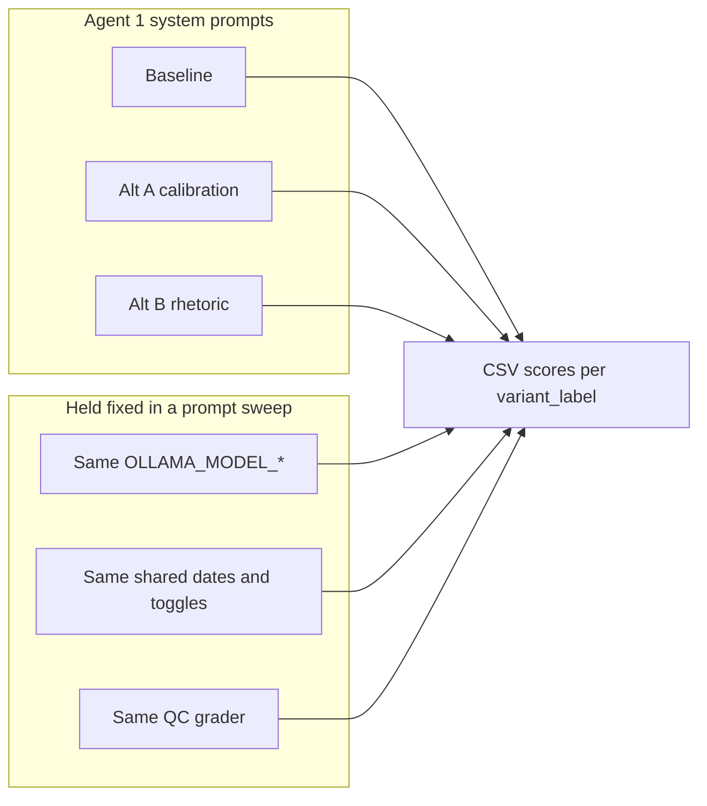

# Three Agent 1 prompts — comparison guide

Human-facing notes for QC experiment design. **Not** loaded into the model unless pasted into a prompt file.

## Purpose of the three-way design

We hold **Validation Criteria Set #1** fixed ([`qc_prompt.py`](../qc_prompt.py) reviewer + [`qc_grader.py`](../qc_grader.py)) and vary **only Agent 1’s system prompt** (via `AGENT1_SYSTEM_PROMPT_PATH` / `prompt_env`). That isolates how **instruction wording and calibration policy** affect report quality **as judged by the same reviewer**.

## The three prompts at a glance

| Prompt file | Example `variant_label` | What differs vs baseline | Primary hypothesis | Metrics to watch |
|-------------|-------------------------|---------------------------|-------------------|------------------|
| [`agent1_baseline.md`](agent1_baseline.md) | `prompt_baseline` | Reference copy of shipped intent (`AGENT1_SYSTEM` semantics). | Stable reference for comparisons. | All |
| [`agent1_alternative_explicit_calibration.md`](agent1_alternative_explicit_calibration.md) | `prompt_alternative_explicit_calibration` | **Policy:** recurrence anchor → severity **± one Likert step**; **4–5** require ≥2 dates or ≥2 entries; thematic relevance guardrail; ambiguity → lower band. Same numeric table. | Reduces severity-driven inflation and thin evidence for high bands; aligns with QC **frequency** dimension. | `frequency_rubric_mean`, `k10_total`, `hallucination` |
| [`agent1_alternative_rhetoric.md`](agent1_alternative_rhetoric.md) | `prompt_alternative_rhetoric` | **Communication only:** plain English (“item you are currently scoring”), **positive** isolation workflow, **numbered** Step 1 frequency / Step 2 severity (baseline band semantics—no ±1 gate, no 4–5 gate), **exemplar** evidence + minimal prohibition. Same table. | Improves parsing and isolation without changing strict calibration rules. | `evidence_relevance_mean`, `frequency_rubric_mean`, qualitative evidence strings |

## Pairwise comparisons (what each contrast estimates)

| Contrast | Estimates |
|----------|-----------|
| **Baseline vs Alt A (calibration)** | Effect of **explicit calibration policy** (gates and ±1 severity), holding baseline rhetoric roughly aside. |
| **Baseline vs Alt B (rhetoric)** | Effect of **notation + positive framing + exemplar**, holding baseline **scoring policy** (no extra gates). |
| **Alt A vs Alt B** | Which lever dominates for your model + diary sample—**strict procedure** vs **clearer instructions**. |

Use **fixed** `OLLAMA_MODEL_AGENT1/2/3`, identical `shared:`, and dedicated `--csv`; then `statistical_comparison.py` / `plot_qc_variants.py` by `variant_label`.

## Baseline profile and non–prompt experiments

Use **`agent1_baseline.md`** (or omit `prompt_env` so the built-in `AGENT1_SYSTEM` applies) when running **model comparisons**, **`rag_env` sweeps**, or **RAG on/off** batches. That keeps Agent 1 instructions aligned with the default product prompt while you isolate **LLM choice** or **retrieval**, and avoids confounding those studies with prompt wording.

Prompt-only studies should use **`qc_config.prompt_sweep.example.yaml`** (or a copy): **only** `prompt_env` paths differ across three variants.

## Optional demo file

[`agent1_variant_b_example.md`](agent1_variant_b_example.md) adds a single tie-break sentence to the baseline body—not part of the core three-prompt science story; kept for quick demos.

## File index

| File | Role |
|------|------|
| [`agent1_baseline.md`](agent1_baseline.md) | Reference; use for non–prompt QC runs |
| [`agent1_alternative_explicit_calibration.md`](agent1_alternative_explicit_calibration.md) | Alternative A — calibration / gates |
| [`agent1_alternative_rhetoric.md`](agent1_alternative_rhetoric.md) | Alternative B — rhetoric / framing |
| [`agent1_variant_b_example.md`](agent1_variant_b_example.md) | Optional tiny variant |

## Detail: Alternative A (explicit calibration)

See historical bullets in git history or inline in [`agent1_alternative_explicit_calibration.md`](agent1_alternative_explicit_calibration.md): ordered anchor → severity capped at ±1 step; high-score breadth gate; stem-specific counting; evidence signals for 4–5; conservative ambiguity rule.

## Detail: Alternative B (rhetoric)

1. **Concrete language** — Replaces abstract “item k / item j” with **the item you are currently scoring** / **any other item** to reduce misreads on weaker models.  
2. **Positive isolation** — Workflow stated as what **to do** (score one item, write evidence, proceed) rather than only prohibitions.  
3. **Named steps** — Step 1 = frequency band; Step 2 = severity within band (same meaning as baseline table footnote, made procedural).  
4. **Exemplar evidence** — One concrete good example plus a **short** “do not output only a numeral/label” guardrail.
