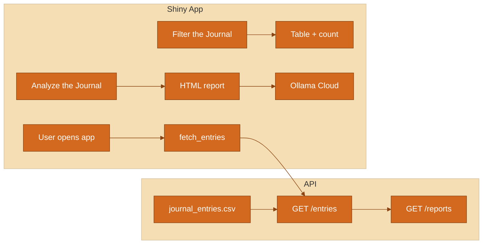

# Journal Analyzer

Personal journal analysis app: filter entries and generate AI-powered reports. Two-panel layout: **Filter the Journal** (filters + results table) and **Analyze the Journal** (date range + trend phrases → HTML report with Ollama summaries). Built with FastAPI and Shiny for Python.

## <span style="color:#DD4633">📑 Table of Contents</span>

- [Overview](#-overview)
- [Data summary](#-data-summary)
- [Technical details](#-technical-details)
- [Usage instructions](#-usage-instructions)
- [Filters and AI report](#-filters-and-ai-report)
- [Errors and messages](#-errors-and-messages)
- [How it works](#-how-it-works)
- [Related files](#-related-files)

---

## 📊 Overview

- **API** (`api.py`) — Serves journal entries from [journal_entries.csv](journal_entries.csv) at `GET /entries` and `GET /reports/{filename}` for generated reports. Run with `uvicorn api:app`.
- **Shiny app** (`app.py`) — Two panels: left = filter entries (date, day, time, keywords) and view results; right = set analysis date range and trend phrases, then generate an HTML report with charts and AI summaries (Ollama Cloud). Theme: **#DD4633** (primary), **#FEECEA** (background).

---

## 📋 Data summary

The API returns journal entries as JSON. Each record has the following columns:

| Column name   | Data type | Description |
|---------------|-----------|-------------|
| `date`        | string    | Entry date in ISO format (YYYY-MM-DD). |
| `day_of_week` | string    | Day of the week (e.g. Monday, Sunday). |
| `time_of_day` | string    | Time slot: `morning`, `afternoon`, or `evening`. |
| `text`        | string    | Full journal entry text. |

Source: [journal_entries.csv](journal_entries.csv) (same columns).

---

## 🔧 Technical details

### API keys and environment

- **OLLAMA_API_KEY** (optional) — Set in a `.env` file in this folder to enable AI summaries in the generated report. Get a key from [Ollama](https://ollama.com). If unset, the report still includes charts and structure; AI sections show "Not available".
- **JOURNAL_API_URL** (optional) — Base URL of the Journal Analyzer API. Default: `http://127.0.0.1:8000`. Override for a different host/port.

### API endpoints

| Endpoint | Method | Description |
|----------|--------|-------------|
| `/entries` | GET | Returns all journal entries as JSON array. |
| `/health`  | GET | Readiness check; returns `{"status": "ok"}`. |
| `/reports/{filename}` | GET | Serves a generated report HTML file from the `reports/` directory. |

### Packages (see [requirements.txt](requirements.txt))

- **API:** fastapi, uvicorn, pandas  
- **Shiny app:** shiny, shiny[theme], pandas, requests, python-dotenv  
- **Report generation:** markdown, plotly  
- **AI:** requests (Ollama Cloud API)

### File structure

```
JournalAnalyzer/
├── api.py              # FastAPI app: /entries, /health, /reports/{filename}
├── app.py              # Shiny app: two-panel UI and server logic
├── report_builder.py   # Builds HTML report: excerpts, Ollama prompts, charts
├── utils.py            # fetch_entries, filter_entries, filter_entries_by_date_only, ollama_chat
├── requirements.txt   # Python dependencies
├── journal_entries.csv # Sample data (date, day_of_week, time_of_day, text)
├── workflow_diagram.md # High-level report workflow (Input → Summarize → Interpret → Format → Output)
├── .env                # Optional: OLLAMA_API_KEY, JOURNAL_API_URL (not in repo)
├── .gitignore
└── reports/            # Generated HTML reports (gitignored)
```

---

## ▶️ Usage instructions

### 1. Install dependencies

```bash
cd JournalAnalyzer
pip install -r requirements.txt
```

Requires **Python 3.8+**.

### 2. Set up API keys (optional)

To enable AI summaries in the report:

1. Create a `.env` file in the `JournalAnalyzer` folder.
2. Add a line: `OLLAMA_API_KEY=your_key_here` (get a key from Ollama).
3. Do not commit `.env`; it is listed in `.gitignore`.

### 3. Run the software

**Step 1 — Start the API** (first terminal):

```bash
cd JournalAnalyzer
uvicorn api:app --reload
```

Leave running. Default: <http://127.0.0.1:8000>.

**Step 2 — Start the Shiny app** (second terminal):

```bash
cd JournalAnalyzer
shiny run app.py --port 8001
```

Open the URL shown (e.g. **http://127.0.0.1:8001**).

**If you see Error -102 or "Connection refused"** — Start the Shiny app with the command above and leave it running, then open the URL again.

---

## 🔍 Filters and AI report

- **Filter the Journal:** Use date range (optional), day of week, time of day, and keywords (comma-separated, wildcard `*`). Results table shows matching entries; full text on hover.
- **Analyze the Journal:** Set "Analysis date range" and optional "Trend(s) to analyze" (comma-separated phrases). Click **Generate report**. Download or open the HTML report (overall activity/emotion, observations by month/day/time, trends by phrase, appendix).

---

## ⚠️ Errors and messages

- **"Unable to load journal entries…"** — Start the API first: `uvicorn api:app`, then reload the Shiny app.
- **"No journal entries match your criteria."** — Loosen filters or analysis date range.
- **"Set OLLAMA_API_KEY in .env…"** — Optional; add the key to `.env` to enable AI summaries.

---

## 🔄 How it works



1. On load, the app fetches all entries from the API.
2. Filters update the table and count. Analysis date range + trend phrases feed the report builder; the report uses excerpts and optional Ollama for summaries.

---

## 🔗 Related files

| File | Description |
|------|-------------|
| [api.py](api.py) | FastAPI backend: loads CSV, serves `/entries`, `/health`, `/reports/{filename}`. |
| [app.py](app.py) | Shiny app: two-panel UI, server logic, theme. |
| [report_builder.py](report_builder.py) | Report: excerpts, life-activity/emotion prompts, observations tables, trend-by-phrase charts. |
| [utils.py](utils.py) | Helpers: `fetch_entries()`, `filter_entries()`, `filter_entries_by_date_only()`, `ollama_chat()`, `get_api_base()`. |
| [requirements.txt](requirements.txt) | Python dependencies. |
| [journal_entries.csv](journal_entries.csv) | Sample journal data. |
| [workflow_diagram.md](workflow_diagram.md) | Report workflow diagram. |
