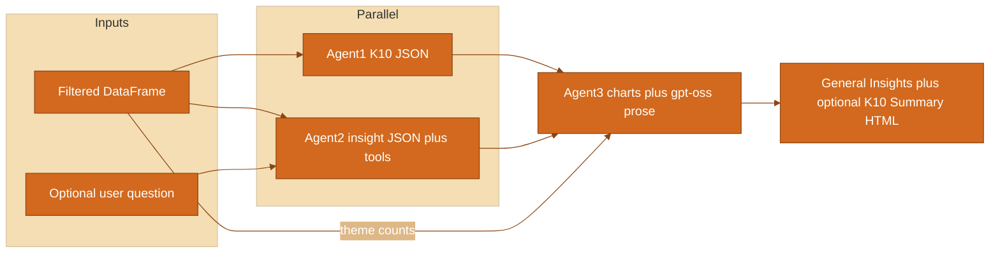

# Journal Analyzer

Personal journal analysis: filter entries and generate HTML reports. **Today:** two-panel [Shiny](app.py) UI + optional [FastAPI](api.py) for entries; reports are built in [report_builder.py](report_builder.py) using a **multi-agent** pipeline (**Agent 1** K10 tool pass, **Agent 2** insights + correlation tools, **Agent 3** deterministic Plotly charts + **Ollama Cloud** `gpt-oss:20b-cloud` prose). Theme: **#DD4633** / **#FEECEA**.

## <span style="color:#DD4633">📑 Table of Contents</span>

- [Overview](#-overview)
- [Links to Code](#links-to-code)
- [Design plan (archived)](#design-plan-archived)
- [System architecture (multi-agent)](#-system-architecture-multi-agent)
- [Data & retrieval](#-data--retrieval)
- [Tool functions (planned)](#-tool-functions-planned)
- [Technical details](#-technical-details)
- [Usage instructions](#-usage-instructions)
- [Filters & AI report](#-filters--ai-report)
- [Errors & messages](#-errors--messages)
- [Related files](#-related-files)

---

## 📊 Overview

| | |
|--|--|
| **Shiny app** | [app.py](app.py) — left: filters + table; right: analysis date range, trend phrases, **Generate report**. |
| **API** | [api.py](api.py) — `GET /entries` from **Supabase** (`journal_entry`) when `SUPABASE_URL` + key are set; else **CSV** fallback. `GET /health`, `GET /reports/{filename}`. |
| **Report** | [report_builder.py](report_builder.py) — parallel Agents 1–2, then Agent 3 HTML (*General Insights*, optional *K10 Summary*). Agent 3 uses **two separate LLM calls** so *General Insights* is based on **Agent 2 only**, and *K10 Summary narrative* is based on **Agent 1 only**. |

**Agents:** **Agent 1** Nemotron (e.g. `OLLAMA_MODEL_AGENT1`) + one K10 tool call on the last **30 days** of the analysis window; **Agent 2** same model family + `list_metrics` / `compute_correlation` + `insight_output` JSON; **Agent 3** `OLLAMA_MODEL_AGENT3` (default `gpt-oss:20b-cloud`) for prose. See [v2_architecture.md](v2_architecture.md).

---

## Links to Code

Use these **relative links** in this repo; on GitHub/GitLab they become permanent URLs as  
`https://github.com/<org>/<repo>/blob/<branch>/JournalAnalyzer/<path>` (adjust host and branch).

| What to link | File | What it is |
|--------------|------|------------|
| **Multi-agent orchestration** | [report_builder.py](report_builder.py) | Runs Agent 1 ∥ Agent 2 (when K10 is enabled), optional K10 snapshot save, then Agent 3 HTML via `build_agent3_report`. |
| **RAG / retrieval** | [embedding_pipeline.py](embedding_pipeline.py), [retrieval.py](retrieval.py), [supabase_migration_journal_rag.sql](supabase_migration_journal_rag.sql) | When **`SUPABASE_*`** is set, **`sentence-transformers`** is installed (default), and the RAG migration is applied, each report run **incrementally** chunks/embeds missing rows with **local** embeddings (aligned with [`05_embed.py`](../dsai/07_rag/05_embed.py)), then retrieves passages for **Agent 1** (one search per K10 item; see below) and **Agent 2**. Optional **`EMBEDDING_BACKEND=openai`** uses **`OPENAI_API_KEY`** instead. If RAG is unavailable, fails, or returns no K10 hits, Agent 1 uses a **structured full-diary** prompt ([`build_k10_structured_full_diary_prompt`](context_builder.py)) for the 30-day window. |
| **Function calling / tool definitions** | [agents/agent1_k10.py](agents/agent1_k10.py) (`TOOL_ESTIMATE_K10`, K10 tool run), [agents/agent2_insight.py](agents/agent2_insight.py) (`TOOLS_AGENT2`), [ollama_client.py](ollama_client.py) (chat + `run_tool_loop_until_text`), [agents/correlations.py](agents/correlations.py) (`compute_correlation` math), [k10_utils.py](k10_utils.py) (validation after tool args) | Agent 1: one K10 tool call. Agent 2: `list_metrics` / `compute_correlation` loop, then `insight_output` JSON. |
| **Main system (Shiny app)** | [app.py](app.py) | Primary UI: filters, analysis range, report generation. |
| **Optional: REST API** | [api.py](api.py) | Separate FastAPI service for `/entries` and served reports (local dev); not required for Connect in-process Supabase load. |

**Private repos:** grant read access or attach a release zip; paths above stay the same.

### Design plan (archived)

The full multi-agent pipeline specification (agents, models, error handling, deployment) is saved for reference in [docs/multi-agent_journal_pipeline_plan.md](docs/multi-agent_journal_pipeline_plan.md) (export of the original Cursor plan). The **K10 per-item RAG** design is archived in [docs/k10_per-item_rag_scoring_plan.md](docs/k10_per-item_rag_scoring_plan.md). The **Agent 3 report improvements** plan is archived in [docs/agent_3_report_improvements_plan.md](docs/agent_3_report_improvements_plan.md). The **Journal RAG incremental embeddings** plan is archived in [docs/journal_rag_incremental_embeddings_plan.md](docs/journal_rag_incremental_embeddings_plan.md).

---

## 🏗 System architecture (multi-agent)

Agents run in parallel where possible; **Agent 3** merges outputs into HTML.


```mermaid
%%{init: {'theme':'base', 'themeVariables': {'primaryColor':'#D2691E', 'primaryBorderColor':'#8B4513', 'lineColor':'#8B4513', 'secondaryColor':'#DEB887', 'tertiaryColor':'#F5DEB3', 'primaryTextColor':'#fff', 'secondaryTextColor':'#333', 'tertiaryTextColor':'#333'}}}%%
flowchart LR
  subgraph in [Inputs]
    DF[Filtered DataFrame]
    UQ[Optional user question]
  end
  subgraph par [Parallel]
    A1[Agent1 K10 JSON]
    A2[Agent2 insight JSON plus tools]
  end
  A3[Agent3 charts plus gpt-oss prose]
  DF --> A1
  DF --> A2
  UQ --> A2
  A1 --> A3
  A2 --> A3
  DF -->|theme counts| A3
  A3 --> OUT[General Insights plus optional K10 Summary HTML]
```

| Agent | Model (planned) | Role |
|-------|------------------|------|
| **1** | [Nemotron-3-Nano](https://ollama.com/library/nemotron-3-nano) (e.g. `nemotron-3-nano:30b-cloud`) | One **tool call** — structured K10 (Likert 1–5, total 10–50), evidence refs; **no** final HTML here. |
| **2** | Same family | **Tool loop** — optional `list_metrics` / `compute_correlation`; final **`insight_output`** JSON (themes, patterns, trends, `query_answer`). |
| **3** | `gpt-oss:20b-cloud` | **Deterministic** Plotly charts + **LLM** prose from structured inputs; two sections: **General Insights** first, optional **K10 Summary**. |

**Vector RAG (optional):** With **sentence-transformers** (default) or **OpenAI** embeddings + **pgvector** tables, Agents 1–2 receive **retrieved excerpts** instead of always the full diary; correlation **r** still only via tools (`correlation_sidecar`), not invented in prose.

---

## 📡 Data & retrieval

| Topic | Detail |
|-------|--------|
| **Master data** | **Supabase** table `journal_entry` (see [supabase_migration_journal_entry.sql](supabase_migration_journal_entry.sql), [SUPABASE_JOURNAL.md](SUPABASE_JOURNAL.md)). |
| **Chunk + vector tables** | Optional **`journal_chunk`** + **`journal_chunk_embedding`** after [supabase_migration_journal_rag.sql](supabase_migration_journal_rag.sql) (enable **pgvector**). |
| **In-memory** | Entries load into a **pandas** `DataFrame`; filters apply client-side. |
| **Agent context** | **Agent 1:** last **30 calendar days** — **RAG** runs **one retrieval per stem** ([`retrieve_k10_per_item_rows`](retrieval.py) + [`format_k10_per_item_rag_prompt`](context_builder.py) with [`K10_RAG_QUERIES`](k10_utils.py)) so evidence stays item-scored; prompts ask the model to combine **frequency** and **severity** per item. If RAG is off or every item is empty, Agent 1 gets the **structured full diary** fallback (stems + journal text). **Agent 2:** **RAG** when you supply a **user question** and/or **trend phrase(s)** — queries are embedded and matched; else **full** analysis-window bundle (character budget). Agent 3 writes **one trend subsection per keyword** (each keyword gets its own mention-count chart); if a keyword has **0 mentions** in the window, the report says so explicitly. |
| **Incremental embed** | On each report, only chunks **missing** embeddings for the current `EMBEDDING_MODEL` are embedded (first run after deploy can be slower). |

---

## 🔧 Tool functions (planned)

Ollama **chat** + **tools** for Agents 1–2; orchestrator fills **`correlation_sidecar`** from tool results.

| Name | Agent | Purpose | Parameters (conceptual) | Returns |
|------|--------|---------|---------------------------|---------|
| `estimate_k10_from_journal` (or `k10_score`) | 1 | Structured K10 from journal | `item_scores` (10× 1–5), evidence, etc. | Validated K10 payload for Agent 3 |
| `list_metrics` | 2 | List correlation-ready metrics | None | Registry ids + short labels |
| `compute_correlation` | 2 | Quantify association | `metric_a`, `metric_b` (registry ids) | `r`, `n`, method, caveats → **sidecar** |
| *(final message)* | 2 | Not a tool — **JSON** | — | `insight_output` (themes, patterns, trends, `query_answer`) |

---

## 🛠 Technical details

### Environment variables

| Variable | Required? | Purpose |
|----------|------------|---------|
| `SUPABASE_URL`, `SUPABASE_KEY` | **Yes** for production (per project plan) | Load `journal_entry` |
| `EMBEDDING_BACKEND` | Optional | Default **`sentence_transformers`** (local, no API key). Set **`openai`** to use OpenAI embeddings instead. |
| `OPENAI_API_KEY` | Optional | Required only if **`EMBEDDING_BACKEND=openai`** (embeddings); not needed for default MiniLM RAG |
| `EMBEDDING_MODEL` | Optional | Default **`all-MiniLM-L6-v2`** (ST) or **`text-embedding-3-small`** when backend is OpenAI |
| `EMBEDDING_DIMENSION` | Optional | Default **`384`** (ST MiniLM) or **`1536`** for OpenAI; must match DB `vector(...)` in [supabase_migration_journal_rag.sql](supabase_migration_journal_rag.sql) |
| `EMBED_BATCH_SIZE` | Optional | Default `32` (embedding batch size) |
| `RAG_MIN_SIMILARITY`, `RAG_K10_TOP_K`, `RAG_AGENT2_TOP_K`, `RAG_K10_CHAR_BUDGET`, `RAG_K10_PER_ITEM_CHAR_BUDGET`, `RAG_AGENT2_CHAR_BUDGET` | Optional | Tune retrieval breadth and prompt size (K10 total vs per-item cap) |
| `RAG_K10_PARALLEL`, `RAG_K10_PARALLEL_WORKERS` | Optional | Parallel per-item K10 retrieval (default on); set `RAG_K10_PARALLEL=0` to serialize |
| `OLLAMA_API_KEY` | Optional today | AI summaries / agents via Ollama Cloud |
| `JOURNAL_API_URL` | Optional | API base (default `http://127.0.0.1:8000`) |
| `OLLAMA_MODEL_AGENT1`, `OLLAMA_MODEL_AGENT2` | Optional | Default e.g. `nemotron-3-nano:30b-cloud` (same value for both is fine) |
| `OLLAMA_MODEL_AGENT3` | Optional | Default `gpt-oss:20b-cloud` |
| `OLLAMA_HOST` | Optional | Ollama API base (default `https://ollama.com`) |

### API endpoints ([api.py](api.py))

| Endpoint | Method | Description |
|----------|--------|-------------|
| `/entries` | GET | All entries as JSON |
| `/health` | GET | `{ "status", "entries_source" }` |
| `/reports/{filename}` | GET | HTML from `reports/` |

### Packages ([requirements.txt](requirements.txt))

`fastapi`, `uvicorn`, `pandas`, `shiny`, `shiny[theme]`, `requests`, `python-dotenv`, `supabase`, `sentence-transformers`, `openai`, `markdown`, `plotly`.

### File structure

```
JournalAnalyzer/
├── app.py                 # Shiny UI
├── api.py                 # FastAPI: entries, health, reports
├── report_builder.py      # Multi-agent orchestration + optional RAG
├── embedding_pipeline.py  # Chunk + incremental OpenAI embeddings → Supabase
├── retrieval.py           # pgvector RPC + merged query results
├── utils.py               # fetch, filter, ollama_chat
├── data_loader.py         # Supabase journal load (retries)
├── ollama_client.py       # Chat + tool loops
├── json_utils.py          # JSON extract / insight normalization
├── k10_utils.py           # K10 bands + tool validation
├── k10_report_html.py     # K10 Likert table HTML fragment (aligned with course k10_report.html)
├── snapshot.py            # k10_snapshot insert / fetch
├── context_builder.py     # Entry bundles for agents
├── scripts/
│   └── test_multi_agent_workflow.py   # CLI: test multi-agent workflow (Supabase → build_report)
├── requirements.txt
├── journal_entries.csv    # Sample data for API CSV fallback
├── docs/                  # archived plans: multi-agent pipeline, K10 RAG, Agent 3, journal RAG embeddings
├── v2_architecture.md     # v2 diagram + goals
├── SUPABASE_JOURNAL.md    # Supabase setup notes
├── supabase_migration_journal_entry.sql
├── supabase_migration_journal_rag.sql   # pgvector 384-d (sentence-transformers default)
├── supabase_migration_journal_rag_openai_1536.sql  # optional 1536-d for EMBEDDING_BACKEND=openai
├── supabase_migration_journal_rag_upgrade_1536_to_384.sql  # upgrade old OpenAI 1536 installs
├── supabase_migration_k10_snapshot.sql
├── load_journal_to_supabase.py
├── generate_journal_entries.py
├── reports/               # Generated HTML (gitignored)
└── agents/                # agent1_k10, agent2_insight, agent3_merge, correlations, theme_frequency
```

---

## ▶️ Usage instructions

1. **Install:** `cd JournalAnalyzer && pip install -r requirements.txt` (Python **3.8+**).

2. **Configure:** Create `.env` — at minimum **`SUPABASE_URL`** + **`SUPABASE_KEY`** for DB-backed entries (see [SUPABASE_JOURNAL.md](SUPABASE_JOURNAL.md)). Add **`OLLAMA_API_KEY`** for AI text. Optional: `JOURNAL_API_URL`.

3. **Run (development — two terminals):**  
   - Terminal A: `uvicorn api:app --reload` → <http://127.0.0.1:8000>  
   - Terminal B: `shiny run app.py --port 8001` → open printed URL.

4. **Test the multi-agent pipeline without the dashboard:** From `JournalAnalyzer`, with `.env` containing **`SUPABASE_URL`**, **`SUPABASE_KEY`**, and **`OLLAMA_API_KEY`**, run:

   ```bash
   python scripts/test_multi_agent_workflow.py
   ```

   This calls [`report_builder.build_report`](report_builder.py) after loading all rows from Supabase and filtering to your analysis range. **Defaults** match a typical test: year **2026**, question *“how is my energy been going?”*, trend keyword **OCD**, **K10 Summary on**, **K10 history chart off**. Override with flags, e.g. `--year 2025 --question "..." --trends "anxiety,mood" --no-k10 --k10-trends`. The script prints the path to the generated HTML under `reports/`. See `python scripts/test_multi_agent_workflow.py --help`.

5. **Deploy (Posit Connect Cloud):** Publish **one** Shiny app (`shiny run` / Connect manifest). Set **environment variables** in Connect (not committed `.env`): `SUPABASE_URL`, `SUPABASE_KEY` or `SUPABASE_SERVICE_ROLE_KEY`, `OLLAMA_API_KEY`, optional `EMBEDDING_BACKEND` / `OPENAI_API_KEY` (only if using OpenAI embeddings), `OLLAMA_HOST`, `OLLAMA_MODEL_AGENT1`, `OLLAMA_MODEL_AGENT2`, `OLLAMA_MODEL_AGENT3`. The app loads journal rows **in-process** from Supabase (no CSV fallback when those vars are set). Apply [supabase_migration_k10_snapshot.sql](supabase_migration_k10_snapshot.sql) if you use K10 history charts. Apply [supabase_migration_journal_rag.sql](supabase_migration_journal_rag.sql) (384-d, **sentence-transformers** default) or [supabase_migration_journal_rag_openai_1536.sql](supabase_migration_journal_rag_openai_1536.sql) if you use **`EMBEDDING_BACKEND=openai`**. If you previously used 1536-d vectors, run [supabase_migration_journal_rag_upgrade_1536_to_384.sql](supabase_migration_journal_rag_upgrade_1536_to_384.sql) to align with the default embedder. **First report after RAG setup** may take longer while missing chunks are embedded. **Timeouts:** multi-agent runs can exceed default gateway limits—increase the content timeout in Connect or narrow the analysis date range. Pin dependencies with [requirements.txt](requirements.txt).

---

## 🔍 Filters & AI report

**Filters:** Date range, day of week, time of day, keywords (`*` wildcard). **Report:** Analysis date range, optional **trend phrase(s)** (comma-separated), optional **user question**, toggles for **K10 Summary** and **K10 trend chart**.

**General Insights** (single top-level heading): Opens with a **data-source sentence** (entry count and date range). Subsections are fixed: **Overall summary**, **Key themes observed**, **Emerging and fading patterns**, **Your question**, **Trends and correlations** (including tool-backed `correlation_sidecar` when present), **Suggested next steps**. Agent 3 returns **structured JSON** fields; the app assembles HTML and fills gaps from Agent 2’s `insight` when the API key is missing or the model omits fields.

**Charts:** If you set **trend phrase(s)**, the monthly line chart measures **matches for those phrases** in journal text (mean per entry by month). The separate **theme frequency** bar chart is shown only when **no** trend phrases are set (it counts matches on Agent 2 theme names). **K10 Summary** includes a **deterministic Likert table** (same structure as the course `k10_report.html`) plus a short narrative summary; optional **K10 history** chart when enabled.

With `OLLAMA_API_KEY`, Agents 1–3 run as configured; without it, you get deterministic charts and fallback text from `insight` JSON. With **RAG** enabled (Supabase + migration + **`sentence-transformers`** or OpenAI embeddings), the UI shows **Indexing journal passages…** then **Generating AI summaries…** during report generation.

---

## ⚠️ Errors & messages

| Message | Cause |
|---------|--------|
| Unable to load entries | API not running (when not using Supabase env vars), or Supabase load failed after retries |
| No matching entries | Tighten filters or widen range |
| Ollama / AI unavailable | Missing or invalid `OLLAMA_API_KEY`, or network error |

---

## 🔗 Related files

| File | Role |
|------|------|
| [app.py](app.py) | Shiny UI |
| [api.py](api.py) | REST API for entries |
| [report_builder.py](report_builder.py) | Report HTML |
| [k10_report_html.py](k10_report_html.py) | K10 table fragment for reports |
| [scripts/test_multi_agent_workflow.py](scripts/test_multi_agent_workflow.py) | Test multi-agent workflow from CLI (Supabase + `build_report`) |
| [utils.py](utils.py) | HTTP + Ollama helper |
| [v2_architecture.md](v2_architecture.md) | v2 diagram |
| [workflow_diagram.md](workflow_diagram.md) | v1 report flow |
| [SUPABASE_JOURNAL.md](SUPABASE_JOURNAL.md) | Database setup |
| [journal_k10_workflow.py](../dsai/08_function_calling/journal_k10_workflow.py) | K10 tools |

