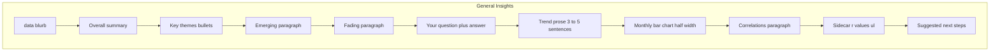

# Agent 3 report improvements

Archived copy of the Cursor plan (see also `.cursor/plans/agent_3_report_improvements_450de3cb.plan.md` in the project root).

## Current behavior (baseline)

- **Generated line** is built in [`agent3_merge.py`](../agents/agent3_merge.py) (~line 272): `Generated: {ts} — {n_entries} entries, {d0} to {d1}`.
- **General Insights** body is assembled in `_assemble_general_insights_html`: data blurb → overall summary → key themes → single combined **Emerging and fading** paragraph → your question → **Trends and correlations** (one prose blob + correlation `<ul>` from `correlation_sidecar`).
- **Trend chart** is appended **after** the whole General Insights block (same file ~276–278), not nested under “Trends and correlations”.
- Charts use [`theme_frequency.py`](../agents/theme_frequency.py): `monthly_trend_phrase_chart_html` is a **line** chart of **mean matches per entry** by month (`_monthly_metric_series` + `findall` density).

## 1. Trim the “Generated” line

- Change the `<em>Generated: …</em>` line to **only** the timestamp (e.g. `Generated: 2026-04-05 19:42`), removing the em dash and the `N entries, date_from to date_to` suffix.

## 2. Overall summary: synthesize, not isolated

- Update the **Agent 3 system prompt** in `build_agent3_report` so `overall_summary` must read as a **cohesive synthesis** of the same journal window, explicitly tying together what will appear in key themes, patterns, the user question, and trends—**not** a standalone anecdote. Keep a single JSON call; the brief already contains `insight`, `trend_keywords`, and `correlation_sidecar` so the model can align wording.
- Optionally **rename in the prompt** to “executive overview” if helpful; no new JSON keys required unless you prefer splitting later.

## 3. Key themes: longer, observational bullets

- In the same system prompt, require **each** bullet under `key_themes_observed` to be roughly **20–40 words**, describing **what was observed** in the journal (patterns, not labels only). Keep newline-separated bullets.
- In [`normalize_agent3_sections`](../json_utils.py), optionally add a **soft fallback** (e.g. concatenate theme name + description from `insight.themes`) with a target length—only if the model returns short bullets; avoid heavy validation loops.

## 4. Emerging vs fading: two paragraphs (3–5 sentences each)

- Extend the Agent 3 JSON schema with two keys, e.g. `**emerging_patterns_paragraph`** and `**fading_patterns_paragraph`** (plain strings), and deprecate or ignore the old combined `emerging_and_fading` for assembly (keep backward compatibility in `normalize_agent3_sections` by mapping old key → both if new keys missing).
- Update `_assemble_general_insights_html` to render:
  - `<h3>Emerging patterns</h3>
…
`
  - `<h3>Fading patterns</h3>
…
`
- Prompt: each paragraph **3–5 sentences**, grounded in `insight.emerging_patterns` / `fading_patterns` lists and the brief.

## 5. Your question

- In `_assemble_general_insights_html`, before the answer paragraph, add a line such as **“Your question:”** with `html.escape(user_query)` when non-empty; if empty, keep current “no specific question” behavior via existing prose rules.
- Extend the Agent 3 prompt: `user_question_answer` must be **3–5 sentences**, reference **concrete time structure** (e.g. early months vs later months within `date_from`–`date_to`), and describe **change over time** where the brief supports it (Agent 2 already has first/second half context in [`agent2_insight.py`](../agents/agent2_insight.py) bundle—no change required there for MVP).

## 6. Trends and correlations: prose split, chart placement, semantics, chart type

**Layout**

- **Move** the monthly trend visualization **inside** the General Insights section, under `<h3>Trends and correlations</h3>`:
  1. **Trend** subsection: 3–5 sentence prose (user-specified trend phrase(s) only—see below).
  2. **Chart** (when `want_trend_chart` and `trend_keywords` non-empty): directly under that prose.
  3. **Correlation** subsection: **separate paragraph** (new JSON key, e.g. `correlations_paragraph`) that interprets `correlation_sidecar` / qualitative gaps; keep the existing **tool-backed** `<ul>` from `_correlation_sidecar_html` **below** that paragraph so numeric `r` values stay faithful.

**Trend semantics (prompt + brief)**

- In `build_agent3_report`, precompute a small structured hint for the brief, e.g. `trend_keywords_positive` vs `trend_keywords_negated` by parsing phrases that start with `**no`**  (case-insensitive), stripping the prefix for matching. Instruct Agent 3: for plain phrases like `OCD` or `depression`, interpret as **occurrence / signs** in the journal; for `**no X`**, interpret prose as tracking **absence / reduction** of X, and **do not** invert to “more illness” unless the journal supports it.

**Chart: monthly bar, mention frequency, half width**

- Add `**monthly_trend_mentions_bar_chart_html`** (or similar) in [`theme_frequency.py`](../agents/theme_frequency.py): group by calendar month over `entries_df`, and for each month compute **total mention count** across entries (sum of `findall` counts per entry, OR count entries with ≥1 match—**pick one** and document; sum of matches matches “frequency of mentions” literally).
- Use **Plotly bar** (`px.bar` or `go.Bar`), x = month, y = count; title includes **“Trend to analyze: …”** from joined `trend_keywords`.
- **Half size**: `fig.update_layout(width=..., height=..., margin=...)` (~50% of current default feel, e.g. width ~480–560px) and/or wrap in a `
` with CSS `max-width: 50%` in `_REPORT_CSS`.
- Replace use of `monthly_trend_phrase_chart_html` for the **user trend phrase** path when building this report section (keep `monthly_mood_proxy_chart_html` only when there are **no** `trend_keywords` but `want_trend_chart` is true—document behavior).

**Remove duplicate placement**

- Stop appending the same chart **again** after General Insights (~lines 276–278) when it is already embedded under Trends; if mood-proxy chart is used (no keywords), either embed under Trends or keep one global placement—specify in implementation so the report does not show two identical charts.

## 7. JSON normalization

- Update [`normalize_agent3_sections`](../json_utils.py) for new keys (`emerging_patterns_paragraph`, `fading_patterns_paragraph`, `trends_prose`, `correlations_paragraph` or whatever names you standardize), with fallbacks from old `emerging_and_fading` and combined `trends_and_correlations` strings so older runs / partial JSON still render.

## 8. Testing

- Regenerate via [`scripts/test_multi_agent_workflow.py`](../scripts/test_multi_agent_workflow.py) with `OLLAMA_API_KEY` and `--trends` set; open HTML and verify: shortened Generated line, two emerging/fading paragraphs, question echoed, trend bar under trend prose, correlation paragraph + list, overall summary reads as synthesis.

## 9. Correlation discovery: `find_correlations` (gap vs design doc)

**Problem (current code vs [multi-agent_journal_pipeline_plan.md](multi-agent_journal_pipeline_plan.md) ~line 109):** The archived plan refers to `**find_correlations` / scipy** from tool handlers, but the only implemented symbol is `**compute_correlation_pair`** in [`correlations.py`](../agents/correlations.py). There is **no** `find_correlations` helper and **no** automatic “scan all pairs” — the model must **choose** two metric ids and call `**compute_correlation`** via [`agent2_insight.py`](../agents/agent2_insight.py). The design idea (**do not invent r; only tool-backed numbers**) is already satisfied; the **name** and any “discovery” behavior described in the doc were never implemented.

**Build (this plan):**

1. **Add `find_correlations_impl` (name TBD)** in [`correlations.py`](../agents/correlations.py): over **unique pairs** of ids in `METRIC_REGISTRY`, call the same Pearson path as `compute_correlation_pair` (reuse `series_for_metric` + `pearson_r`). Return a **list of dicts** with the same shape as today’s sidecar entries (`metric_a`, `metric_b`, `r`, `n`, `method`, `caveats`). Omit or mark pairs with insufficient variance; cap output size if needed (e.g. top by `abs(r)` with a note) to avoid huge payloads.
2. **Expose to Agent 2** as an optional tool, e.g. `find_correlations` with empty or minimal parameters, implemented by appending each result to `**correlation_sidecar`** (same as `compute_correlation`) so Agent 3 HTML stays unchanged. Update `**AGENT2_SYSTEM`** so the model may call `**find_correlations`** when exploratory correlation is useful, and still may call `**compute_correlation`** for a specific pair.
3. **Update** [multi-agent_journal_pipeline_plan.md](multi-agent_journal_pipeline_plan.md) around line 109: replace the misleading `find_correlations` reference with the actual API names (`compute_correlation_pair`, new `find_correlations` tool) and one sentence that **pairwise** tool calls remain available.

**Non-goals:** Automatic multiple-comparison correction beyond optional caveats in returned dicts; inventing metrics outside `METRIC_REGISTRY`.

## 10. K10 trends mode (gap vs design doc)

**Reference:** [multi-agent_journal_pipeline_plan.md](multi-agent_journal_pipeline_plan.md) § “Optional — if user selects K10 trends” (lines ~235–239).

**What already exists:** When `include_k10_trends` and `k10_history` are set, [`agent3_merge.py`](../agents/agent3_merge.py) appends a **Plotly line chart** of `total_score` over snapshot times. [`k10_report_html.py`](../k10_report_html.py) renders the K10 table + `k10_summary_narrative` for the **current** estimate.

**Gaps vs doc:**

| Doc bullet                                                                             | Gap                                                                                                                         |
| -------------------------------------------------------------------------------------- | --------------------------------------------------------------------------------------------------------------------------- |
| Compact chart from snapshots                                                           | **Done** (line chart).                                                                                                      |
| Per-question / domain summary (grouped narrative from `item_scores` + labels, compact) | **Not done** — no separate “domain highlights” block; table is full per-item.                                               |
| 3–5 sentences **longitudinal** trend analysis (Agent 3 + **injected series facts**)    | **Not done** — single `k10_summary_narrative` is not trend-specific; no computed stats in the brief for the history series. |

**Build (this plan):**

1. **k10-trend-narrative todo:** In `build_agent3_report`, when `include_k10_trends` and `k10_history` is non-empty, compute a small `k10_history_facts` object in code (e.g. `n_snapshots`, date span from `window_end_date`/`created_at`, min/max/mean `total_score`, optional simple direction label). Add to Agent 3 **brief** and a new JSON key `k10_trend_narrative` (3–5 sentences; must use facts only + caveat if sparse). Extend [`json_utils.py`](../json_utils.py) `normalize_agent3_sections` / Agent 3 assembly so this renders **below** the “K10 history” heading/chart in [`agent3_merge.py`](../agents/agent3_merge.py). Keep `k10_summary_narrative` for the current-window table summary so roles do not collide.
2. **k10-domain-highlights todo:** Add optional **compact domain summary** — either **deterministic** (group indices into 3–4 domains in code, emit 2–4 short lines from current `item_scores`) or **one LLM field** `k10_domain_highlights` with strict “no cell-by-cell repeat” instructions. Render in [`k10_report_html.py`](../k10_report_html.py) or merge step (e.g. after title, before table, or after table). Product choice: only when `include_k10_trends` is true vs whenever K10 section is on.
3. **Testing:** Run workflow with `--k10-trends` and existing snapshots; confirm chart + new narrative + optional domain block.

**Doc alignment:** After implementation, adjust [multi-agent_journal_pipeline_plan.md](multi-agent_journal_pipeline_plan.md) K10 trends subsection to match shipped behavior (if table remains primary, say so).

## 11. Agent 1 and Agent 2 output JSON schema (follow-up)

**Why:** The design doc calls out a missing single source of truth for `insight_output`; Agent 3 and reports benefit from stricter types, structured trends, and explicit correlation metadata. Agent 1’s tool schema can be tightened without changing the orchestrator’s authority over totals/severity.

### Agent 1 (`estimate_k10_from_journal` / `k10_proxy_v2`)

| Recommendation                | Action                                                                                                                                                                                              |
| ----------------------------- | --------------------------------------------------------------------------------------------------------------------------------------------------------------------------------------------------- |
| Stricter tool parameters      | In [`agent1_k10.py`](../agents/agent1_k10.py) `TOOL_ESTIMATE_K10`, set JSON Schema `minimum`/`maximum` (1–5) on each score item where the API accepts it; keep `minItems`/`maxItems` 10. |
| Model vs code ownership       | Document: `**total_score` / `severity`_*** remain derived in [`k10_utils.py`](../k10_utils.py) `estimate_k10_from_journal`; model does not override math.                                |
| Optional `confidence_score`   | If added to the tool, rules: display/snapshots only; orchestrator may clamp; never replace computed bands.                                                                                          |
| Optional `evidence_entry_ids` | Future: parallel length-10 array validated against prompt IDs—only if product needs audit trail beyond string evidence.                                                                             |
| Positional vs object rows     | Prefer keeping arrays unless mis-ordering appears in production; alternative is 10× `{ item_index, score, evidence }` (breaking change).                                                            |
| Versioning                    | Keep `schema: k10_proxy_v2` in payload; one-line changelog when fields change.                                                                                                                      |

### Agent 2 (`insight_output`)

| Recommendation      | Action                                                                                                                                                                                                                                                                                      |
| ------------------- | ------------------------------------------------------------------------------------------------------------------------------------------------------------------------------------------------------------------------------------------------------------------------------------------- |
| Formal schema file  | Add e.g. [`schemas/insight_output.json`](../schemas/insight_output.json) (or Pydantic in code); validate after `extract_json_from_reply` in [`json_utils.py`](../json_utils.py) or a thin `validate_insight_output`.                                  |
| Structured `trends` | Evolve from `string[]` to objects, e.g. `{ "label", "direction": "up" \| "down" \| "flat" }` (minimal shape).                                                                                                                                                                                                                       |
| Themes              | Optional `salience` 1–5 or `order` for deterministic chart/bullet ordering.                                                                                                                                                                                                                 |
| Correlation flag    | Set `**correlation_tools_used**` (bool or call count) in [`report_builder.py`](../report_builder.py) after `run_agent2_insight` by inspecting whether `correlation_sidecar` grew or by instrumenting the tool registry—pass into Agent 3 **brief** (model must not invent this). |
| Version field       | Add `**insight_schema_version`: 1** to normalized output.                                                                                                                                                                                                                                   |
| Length guards       | Max length for `query_answer` and theme `description` in normalizer (trim + log).                                                                                                                                                                                                           |

### Priority (within this section)

1. **High:** Agent 2 schema file + validation; structured `trends` (minimal shape); `correlation_tools_used` in brief.
2. **Medium:** Agent 1 tool numeric constraints; `insight_schema_version`; length limits.
3. **Lower:** Evidence entry ids; full object-per-K10-item tool shape.

## Files to change

| File                                                                                                                     | Role                                                                                                                                                                     |
| ------------------------------------------------------------------------------------------------------------------------ | ------------------------------------------------------------------------------------------------------------------------------------------------------------------------ |
| [`agents/agent3_merge.py`](../agents/agent3_merge.py)                                       | Generated line; `_assemble_general_insights_html` structure; Agent 3 system/user prompts; embed trend chart; pass negated-keyword hint in `brief`; CSS for chart wrapper |
| [`agents/theme_frequency.py`](../agents/theme_frequency.py)                                 | New monthly **bar** chart for trend phrase mention counts                                                                                                                |
| [`json_utils.py`](../json_utils.py)                                                         | `normalize_agent3_sections` for new keys and fallbacks                                                                                                                   |
| [`agents/correlations.py`](../agents/correlations.py)                                       | `find_correlations`-style scan over registry pairs                                                                                                                       |
| [`agents/agent2_insight.py`](../agents/agent2_insight.py)                                   | New tool registration + handler appending to `correlation_sidecar`                                                                                                       |
| [multi-agent_journal_pipeline_plan.md](multi-agent_journal_pipeline_plan.md) | Align § metric registry with implemented symbols; optional K10 trends subsection refresh                                                                                 |
| [`k10_report_html.py`](../k10_report_html.py)                                               | Optional domain highlights fragment; or accept extra narrative blocks from merge step                                                                                    |
| [`agents/agent1_k10.py`](../agents/agent1_k10.py)                                           | §11: tighter `TOOL_ESTIMATE_K10` JSON Schema                                                                                                                             |
| [`k10_utils.py`](../k10_utils.py)                                                           | §11: document/optional fields for `k10_proxy_v2`; optional confidence handling                                                                                           |
| [`schemas/insight_output.json`](../schemas/insight_output.json) (new)                       | §11: canonical `insight_output` schema (optional Pydantic instead)                                                                                                       |
| [`report_builder.py`](../report_builder.py)                                                 | §11: `correlation_tools_used` (or count) into Agent 3 brief                                                                                                              |

No change to [`report_builder.py`](../report_builder.py) for trend keywords unless already covered above. For §11, **do** extend `build_report` / `build_agent3_report` brief with `correlation_tools_used` when implementing that todo. `report_builder` already passes `k10_history` / `include_k10_trends`; extend only if new facts require snapshot fetch changes (unlikely).
