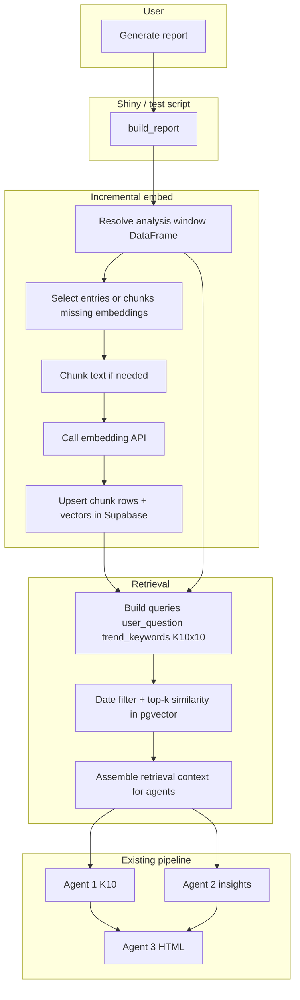

# Journal RAG: incremental chunking and embedding on report run

Archived copy of the Cursor plan (see also `.cursor/plans/journal_rag_incremental_embeddings_3d59835a.plan.md` in the project root).

## Goals

- **Semantic search** over diary text within a **date range**, so themes/trends/scoring are grounded in **conceptually related** passages, not only exact keyword matches.
- **Incremental embedding:** do **not** require a full backfill before first use. On each **report generation**, embed **only** journal rows (or chunks) that are **missing** embeddings for the current embedding model/version.
- Keep the existing multi-agent pipeline; **replace or augment** plain-text context bundles ([`context_builder.py`](../context_builder.py)) with **retrieved chunks** where a query or trend phrase exists.

## High-level workflow (incremental on report)

**Ordering detail:** Run **incremental embed for the analysis window (and for Agent 1’s 30-day K10 slice if different)** **before** Agent 1 / Agent 2 LLM calls, so retrieval and any downstream counts see fresh vectors. If embedding fails for some rows, **degrade**: fall back to current full-text bundle (today’s behavior).

## Data model (Supabase / Postgres)

**1. Keep [`journal_entry`](../supabase_migration_journal_entry.sql)** as the source of truth (`id`, `entry_date`, `text`, …).

**2. Add `journal_chunk`** (one row per chunk of an entry):

| Column                   | Purpose                                               |
| ------------------------ | ----------------------------------------------------- |
| `id`                     | UUID or bigint PK                                     |
| `journal_entry_id`       | FK → `journal_entry.id`                               |
| `chunk_index`            | 0, 1, 2, … within entry                               |
| `entry_date`             | Denormalized for fast date filters (copy from parent) |
| `text`                   | Chunk plain text                                      |
| `char_start`, `char_end` | Optional offsets into parent `text`                   |
| `created_at`             | Audit                                                 |

**3. Add `journal_chunk_embedding`** (or combine into one table with nullable `embedding` until filled):

| Column            | Purpose                       |
| ----------------- | ----------------------------- |
| `chunk_id`        | PK/FK → `journal_chunk.id`    |
| `embedding`       | `vector(dim)` (pgvector)      |
| `embedding_model` | e.g. `text-embedding-3-small` |
| `embedded_at`     | Timestamp                     |

Enable **pgvector** extension in Supabase; create **IVFFlat or HNSW** index on `embedding` with a note to tune `lists` / `m` after data volume is known.

**Optional:** `content_hash` on chunk or entry to skip re-embed when text unchanged.

## Incremental policy (on each report run)

1. **Determine windows:**
  - **Analysis window:** same as today (`date_from`–`date_to` on filtered `entries_df`).
  - **K10 window:** last 30 calendar days within that range (same as [`slice_last_n_calendar_days`](../context_builder.py)).
2. **Collect candidate entry ids** in those windows from the in-memory `DataFrame` (or re-query Supabase for the same filters if you prefer single source).
3. **Find missing embeddings:** SQL or client logic, e.g.
  `journal_entry` ids in window **LEFT JOIN** chunks **LEFT JOIN** embeddings where `embedding IS NULL` or no row for current `embedding_model`.  
   Only those chunks/entries are **chunked** (if new) and **embedded**.
4. **Chunking:** deterministic split (character/token budget with overlap, e.g. 500–800 tokens, 50–100 overlap). Store/update `journal_chunk` rows.
5. **Embed:** batch calls to chosen provider (OpenAI, Voyage, or Ollama embedding endpoint); respect rate limits; store model id.
6. **Commit** before starting Agent 1 / Agent 2 so retrieval sees new vectors.

**Note:** First report after deploy may **take longer** (many embeddings); show UI status “Indexing journal passages…” with the same category-based error style as the rest of the app.

## Retrieval (RAG) for agents

1. **Queries (full set):**
  - `**user_question`** — e.g. energy, anxiety, or any free-form question.
  - `**trend_keywords`** — comma-separated phrases from the dashboard (e.g. OCD), each as its own embedding query or OR-retrieval strategy.
  - **Ten K10 item queries** — one retrieval target per K10 dimension so passages are pulled for *tiredness, nervousness, hopelessness, restlessness, depression, effort, worthlessness*, etc., even when the diary never uses those exact words. Use the **official stem form** aligned with the course HTML (see `OFFICIAL_K10_ROWS` in [`journal_k10_workflow.py`](../../dsai/08_function_calling/journal_k10_workflow.py), e.g. “About how often did you feel tired out for no good reason?”) **or** compact stems derived from [`K10_ITEM_LABELS`](../k10_utils.py); pick one convention in code and document it.
2. **Per query (or batched):**
  - Filter chunks by **entry_date** in the relevant window (**analysis window** for Agent 2; **30-day K10 slice** for Agent 1 K10-focused retrieval).  
  - **Vector similarity** (cosine / inner product per pgvector ops) **top k per query** (e.g. 5–15 chunks per K10 item, dedupe by `chunk_id` across the 10 runs), optional **min similarity** cutoff.
3. **Merging K10 retrieval results:** Union/dedupe retrieved chunks, optionally **weight** by max similarity across the 10 item queries, then trim to a global budget so Agent 1’s prompt stays bounded.
4. **Context assembly:**
  - Build a string: `[date] snippet…` with chunk ids for evidence refs.  
  - Optionally **structure Agent 1** context into **ten short sections** (one per item) filled from that item’s top chunks, plus a shared pool for overlap.  
  - Enforce **character/token budget** (same spirit as `_AGENT2_CHAR_BUDGET`).  
  - Pass to **Agent 2** as the main journal context (user + trend queries); **Agent 1** receives **K10-query retrieval** over the 30-day window.
5. **Charts:** Optional later step: monthly **similarity-weighted** or **count of chunks above threshold** for trend phrases—can stay deterministic in Python using retrieved chunk dates/scores.

## Code touchpoints (future implementation)

| Area                                                                                                                             | Action                                                                                                                                                |
| -------------------------------------------------------------------------------------------------------------------------------- | ----------------------------------------------------------------------------------------------------------------------------------------------------- |
| New SQL migration                                                                                                                | `journal_chunk`, `journal_chunk_embedding`, indexes, RLS if multi-user later                                                                          |
| [`data_loader.py`](../data_loader.py) or new `embedding_pipeline.py`                                                | `ensure_embeddings_for_entries(df, windows, model)`, chunk + embed + upsert                                                                           |
| New `retrieval.py`                                                                                                               | `retrieve_chunks(...)`; helper to build query list from `user_question`, `trend_keywords`, and 10 K10 stems (`K10_ITEM_LABELS` / `OFFICIAL_K10_ROWS`) |
| [`context_builder.py`](../context_builder.py)                                                                       | `build_agent2_context_bundle_rag(...)` with fallback to `build_agent2_context_bundle`                                                                 |
| [`report_builder.py`](../report_builder.py)                                                                         | Call incremental embed, then agents                                                                                                                   |
| [`agents/agent1_k10.py`](../agents/agent1_k10.py) / [`agent2_insight.py`](../agents/agent2_insight.py) | Accept retrieval-based corpus or switch internally                                                                                                    |
| Env                                                                                                                              | `OPENAI_API_KEY` or embedding provider vars; `EMBEDDING_MODEL`; optional `EMBED_BATCH_SIZE`                                                           |
| [`README.md`](../README.md)                                                                                         | Document incremental behavior and first-run latency                                                                                                   |

## Risks and mitigations

- **Latency:** batch embeddings, async optional later; cap chunks per run with user messaging.
- **Cost:** embed only missing chunks; hash unchanged text to skip re-embed.
- **Consistency:** single `embedding_model` column; re-embed all if model changes (migration script).

## Out of scope for first RAG PR (optional follow-ups)

- Full nightly backfill job (incremental-on-report already improves coverage over time as users run reports).
- Hybrid BM25 + vector (can add if recall is weak).
- Multi-tenant RLS on chunk tables (mirror `journal_entry` policy when you add multi-user).
