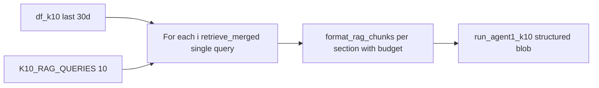

# K10 per-item RAG and frequency/severity scoring

Archived copy of the Cursor plan (see also `.cursor/plans/k10_per-item_rag_scoring_517d736f.plan.md` in the project root).

## Problem (current behavior)

- In [`report_builder.py`](../report_builder.py) `_run_rag_context`, Agent 1 receives **one** blob from `retrieve_merged(list(K10_RAG_QUERIES), ...)` plus [`format_rag_chunks_for_prompt`](../context_builder.py).
- In [`retrieval.py`](../retrieval.py) `retrieve_merged`, chunks are **merged across all queries** and only **one** row per `chunk_id` is kept (max similarity). **Which K10 question led to a hit is discarded**, so the model cannot score item 5 (“restless or fidgety”) from passages retrieved **only** for that query.
- [`run_agent1_k10`](../agents/agent1_k10.py) passes a single `diary_blob` to the tool; the system prompt says “infer how often” but does not separate **frequency** vs **linguistic intensity** in a structured rubric.

## Target behavior

1. **Per-item evidence**: For each K10 item `i` (aligned with [`K10_RAG_QUERIES`](../k10_utils.py) / tool item order), build **retrieved passages using that item’s query only** (vector search with a single query string per call, same date window as today: last 30 days via `df_k10` dates).
2. **Scoring rubric (prompt + tool text)**: Instruct the model to set each Likert score using:
   - **Frequency**: how often the theme appears across the **evidence for that item** (and implicitly across the window—sparse vs repeated mentions).
   - **Severity / intensity**: strength of distress in language when the theme appears (strong wording vs mild), **combined** with frequency to choose **1–5** (official K10 is frequency-based; this makes “severity” explicit as an input to the same scale).
3. **Evidence strings**: Require `item_evidence[i]` to be **grounded in the text under that item’s section** (the RAG block for that question, or the corresponding slice when falling back to full diary).
4. **Fallback**: If RAG is unavailable (`rag_available()` false) or a per-item retrieval returns empty, keep **one** full-diary path but **structure the user message** into 10 labeled sections (official question stems) so the model still reasons per item; optionally duplicate the full diary under each section only if budget allows (prefer a single full diary + clear rule: “for item k, use passages relevant to question k”).

## Implementation sketch



### A. Retrieval helper

- Add a function, e.g. `retrieve_k10_per_item_chunks` in [`retrieval.py`](../retrieval.py) **or** inline in [`report_builder.py`](../report_builder.py): for `i in 0..9`, call existing `retrieve_merged([K10_RAG_QUERIES[i]], d0, d1, top_k_per_query=...)`, return `list[list[dict]]` (or pre-formatted strings).
- Reuse `embed_texts` / RPC as today; **10** retrieval passes (acceptable; optional env `RAG_K10_PARALLEL` to run in a small thread pool for latency).
- Per-item **character budget**: divide `RAG_K10_CHAR_BUDGET` across items (e.g. floor division + remainder) or add `RAG_K10_PER_ITEM_CHAR_BUDGET` so one item cannot consume the whole blob.

### B. Structured prompt builder

- Add a function in [`context_builder.py`](../context_builder.py), e.g. `format_k10_per_item_rag_prompt(rows_per_item: list[list[dict]], questions: list[str]) -> str`, producing:

  ```
  ## Item 1 — [official question stem]
  [chunks formatted like format_rag_chunks_for_prompt lines]
  ## Item 2 — ...
  ```

- Pass this string as `diary_blob` into Agent 1 (same `tool_estimate_k10_from_journal_for_blob` path).

### C. Agent 1 prompt and tool description ([`agent1_k10.py`](../agents/agent1_k10.py))

- **`AGENT1_SYSTEM` + `TOOL_ESTIMATE_K10`**: State explicitly that each `item_scores[k]` and `item_evidence[k]` must be justified **only** from the **## Item k** section when RAG sections are present; for each item, combine **frequency** (how often the theme appears in that section / window) and **severity** (intensity of distress in language) to choose **1–5**.
- **`_user_task` / `corpus_note`**: When using per-item RAG, note: “Diary below is organized by K10 question; do not use Item j text to score Item k.”
- When using **full diary** fallback (no RAG), note that the model must still map each question to the relevant parts of the journal.

### D. Orchestration ([`report_builder.py`](../report_builder.py))

- Replace the single `retrieve_merged(K10_RAG_QUERIES, ...)` for `rag_a1` with the per-item pipeline when `include_k10_section` and RAG is available.
- If any item returns zero rows, still emit that section with a one-line “no passages retrieved” so the model can default to conservative scoring for that item.

### E. Validation ([`k10_utils.py`](../k10_utils.py))

- Optional: keep existing evidence sanitization; no hard requirement to programmatically verify “evidence came from RAG” (fragile). Rely on prompt.

### F. Docs

- Short note in [`multi-agent_journal_pipeline_plan.md`](multi-agent_journal_pipeline_plan.md) or [`README.md`](../README.md) under K10: per-item RAG + frequency/severity rubric.

## Testing

- With `OLLAMA_API_KEY` and Supabase RAG: generate a report and spot-check that HTML K10 evidence thematically matches the item (e.g. restlessness language for item 5).
- With RAG disabled: ensure no crash and fallback still returns 10 scores.

## Risks / tradeoffs

- **Latency/cost**: up to **10×** embedding/RPC passes for K10 (mitigate with parallel retrieval and tight per-item budgets).
- **Empty sections**: model may overuse 1; prompt should say “if no relevant text, prefer 1 and empty evidence”.
