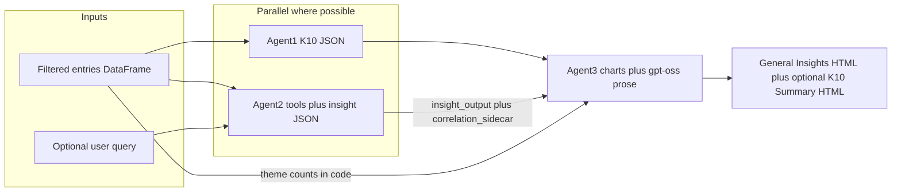

<!-- Archived in-repo copy of the Cursor design plan (`.cursor/plans/multi-agent_journal_pipeline_65794d12.plan.md`) for version control and documentation. -->

---
name: Multi-agent journal pipeline
overview: "Parallel **Agent 1** (NVIDIA **[Nemotron-3-Nano](https://ollama.com/library/nemotron-3-nano)** via Ollama — K10 tool-once, **1–5** / **10–50**, last **30 days**, patterns from `[journal_k10_workflow.py](dsai/08_function_calling/journal_k10_workflow.py)`) and **Agent 2** (same model family, Alternative B: `insight_output` + correlation tools). **Agent 3** combines **code-built charts** + **`gpt-oss:20b-cloud`** (Ollama Cloud) for user-facing report prose/HTML — **two** sections: **General Insights** then optional **K10 Summary**. Extends tool loops, `json_utils`, `app.py`, `report_builder.py`."
todos:
  - id: context-json-utils
    content: Add context builder from DataFrame + shared json_utils (extract/validate JSON)
    status: completed
  - id: correlations-module
    content: Metric registry + correlation tool handlers; Agent2 tool loop + correlation_sidecar for Agent3
    status: completed
  - id: agent1-agent2
    content: Agent1 K10 tool-once on last-30-day slice (from journal_k10 patterns); Agent2 Alternative B; parallel
    status: completed
  - id: agent3-merge
    content: Agent3 — Plotly/charts deterministic; prose via gpt-oss:20b-cloud; General Insights + optional K10 Summary; reconciliation
    status: completed
  - id: wire-report-app
    content: Dashboard toggles (generate K10, optional K10 trends); user question; build_report assembles two sections in order
    status: completed
  - id: k10-snapshots
    content: Optional — persist validated Agent1 K10 to Supabase k10_snapshot (or JSONL MVP) for 12-month trend queries
    status: completed
  - id: posit-connect
    content: Posit Connect Cloud — one Shiny app; Supabase-only load + retries; env vars; hosted LLM; timeouts; pinned deps
    status: completed
isProject: false
---

# Multi-agent architecture (JournalAnalyzer)

**Chosen pattern: Alternative B** — correlation reasoning and optional **compute** tools live **inside Agent 2**; no separate correlation-only LLM agent in the default pipeline.

## Target behavior



- **Agent 1** runs a **tool-first** K10 pass: the model must call the K10 tool **exactly once** and emit **no** free-form assistant text outside that call. Input journal rows are **only** the **most recent 30 days** of entries (see below), not necessarily the same date range as the user’s full “analysis window” for Agent 2.
- **Agent 2** runs a **multi-turn** session: optional **tool calls** (`compute_correlation`, etc.), then a **final** `insight_output` JSON. **Agent 1** and **Agent 2** run **in parallel** on the pipeline (same report run).
- **Agent 3** is **hybrid presentation**: **charts, counts, and figure HTML** are **deterministic** (Python / Plotly); **user-facing prose and section HTML** are produced by **`gpt-oss:20b-cloud`** (same Ollama Cloud stack as current [`ollama_chat`](JournalAnalyzer/utils.py)), conditioned on structured inputs from Agents 1–2, `correlation_sidecar`, and reconciliation rules—**no direct journal quotes** (see **Agent 3** and **LLM models** below).

## LLM models (locked)

| Agent | Model | Role | Notes |
|--------|--------|------|--------|
| **1 (K10)** | **Nemotron-3-Nano** ([Ollama library](https://ollama.com/library/nemotron-3-nano)) | Tool-first K10 (`estimate_k10_from_journal`-style), single tool call | Pick a tag from the series via env, e.g. **`nemotron-3-nano:30b-cloud`** (Ollama Cloud, no local GPU), **`nemotron-3-nano:4b`** (lightweight local), or **`nemotron-3-nano:30b`** — see [tags](https://ollama.com/library/nemotron-3-nano/tags). |
| **2 (insights)** | **Same Nemotron-3-Nano tag** as Agent 1 (unless you later split env vars) | Multi-turn chat + tools → `insight_output` | Aligns with agentic/tool use; same API as Agent 1. |
| **3 (reports)** | **`gpt-oss:20b-cloud`** | Turn structured payloads + rules into **General Insights** and **K10 Summary** prose/HTML; charts inserted as computed | Matches existing JournalAnalyzer cloud model; **not** Nemotron here by product choice. |

**Environment variables (suggested):**

- **`OLLAMA_MODEL_AGENT1`** / **`OLLAMA_MODEL_AGENT2`** — default both to the same value, e.g. `nemotron-3-nano:30b-cloud` (adjust for local vs cloud).
- **`OLLAMA_MODEL_AGENT3`** — default `gpt-oss:20b-cloud`.
- **`OLLAMA_API_KEY`** — Ollama Cloud auth (used for cloud-hosted models including **`gpt-oss:20b-cloud`** and optionally **`nemotron-3-nano:30b-cloud`**). Local-only tags (e.g. `:4b` on `localhost`) may use **`OLLAMA_HOST`** without cloud key per your setup.

**Implementation:** Centralize model IDs in one config module; pass into `agent1_k10`, `agent2_insight`, and the Agent 3 **report writer** client (reuse or extend [`ollama_chat`](JournalAnalyzer/utils.py) for Agent 3 if the API shape matches, or a dedicated **`chat` with structured system prompt** for Agent 3).

## Retrieval context (MVP, no vector DB yet)

- **Time-filtered entries** are already available as a `DataFrame` in `[build_report](JournalAnalyzer/report_builder.py)` and `[app.py](JournalAnalyzer/app.py)` (`filter_entries_by_date_only`).
- **Agent 1 (K10):** After the user’s analysis range is applied, **slice to the last 30 calendar days** (or fewer if the range is shorter) sorted by `date`, for K10-only. Pass **row index or stable id** per line so the model can attach **evidence references** (see tool schema). Aligns with “typically 30 days” in the Agent 1 prompt.
- **Agent 2 (insights):** Build a **context bundle** from the **full** user-selected analysis `DataFrame` (not limited to 30 days unless you choose to align later): ordered entries, ISO date + text, character budget, optional first/second half of window for emerging/fading.
- **Future**: replace this bundle with Supabase + embeddings; keep the same agent function signatures (`context_bundle: str`, `user_query: str | None`).

### K10 per-item RAG (implemented)

- **Retrieval:** [`retrieve_k10_per_item_rows`](../retrieval.py) calls [`retrieve_merged`](../retrieval.py) with **one** query at a time for each of [`K10_RAG_QUERIES`](../k10_utils.py), so chunk lists are **not** merged across items (evidence stays attributable to each stem). Optional parallelism: `RAG_K10_PARALLEL`, `RAG_K10_PARALLEL_WORKERS`.
- **Prompt:** [`format_k10_per_item_rag_prompt`](../context_builder.py) builds `## Item k — [stem]` sections with per-item character budget (`RAG_K10_CHAR_BUDGET`, optional `RAG_K10_PER_ITEM_CHAR_BUDGET`). Empty items get a one-line “no passages retrieved” placeholder.
- **Scoring:** Agent 1 ([`agent1_k10.py`](../agents/agent1_k10.py)) instructs the model to combine **frequency** and **severity** and to ground `item_evidence[k]` only in section *k* when per-item RAG is used.
- **Fallback:** If RAG is unavailable or **all** per-item retrievals are empty, [`build_k10_structured_full_diary_prompt`](../context_builder.py) supplies the full 30-day window plus listed stems (one journal block, not ten duplicates).

## Agent 2 (insight reasoning) — `insight_output` + tools (Alternative B, locked)

- Implement in `[JournalAnalyzer/agents/agent2_insight.py](JournalAnalyzer/agents/agent2_insight.py)` (or `multi_agent.py`): **chat + tool loop** using Ollama Chat API with `tools`, then **parse final assistant content** as **`insight_output`**.
- **System + user prompt** = your earlier instructions verbatim, plus:
  - Always consider **association-style** patterns in personal journals (qualitative); **no fabricated correlation coefficients** in free text—**only** numbers returned from **tools**.
  - Optional tools: `list_metrics()`, `compute_correlation(metric_a, metric_b)` (registry ids only); model **may** call zero or more times.
  - After tools complete, model must emit **JSON** matching **`insight_output`** (same schema as before).

### Agent 2 output: `insight_output` (authoritative)

Same schema as before (`themes`, `emerging_patterns`, `fading_patterns`, `trends`, `query_answer`). Full JSON Schema block unchanged from prior plan revision.

- **Implementation note:** Populate `fading_patterns` as `[]` when absent; clamp `confidence`; normalize with `normalize_insight_output`.

### `correlation_sidecar` (orchestrator, not from model JSON)

- **Do not** require the model to paste **r** values into `insight_output`. The **orchestrator** collects **tool results** from executed `compute_correlation` / `find_correlations` calls into a structured **`correlation_sidecar`** list/dict: `{ "runs": [ { "metric_a", "metric_b", "r", "n", "method", "caveats" } ] }` (exact fields in implementation). Empty `runs` if no tools were called or all failed.
- Agent 3 uses **`insight_output` + `correlation_sidecar`** together.

### Agent 2 and theme frequency (unchanged)

- **Agent 2 does not emit theme frequencies** for charts. Agent 3 **counts** from `entries_df` + `themes` (deterministic).

### Metric registry and tool implementations

- **`[agents/correlations.py](JournalAnalyzer/agents/correlations.py)`:** metric registry, text proxies per entry; **`compute_correlation_pair`** (Pearson via numpy) is used by tool handlers **`compute_correlation`** (one pair) and **`find_correlations`** (all registry pairs). **Only** tool-returned `r` / `n` values are shown in the report—no LLM-invented metrics.
- **`[utils.py](JournalAnalyzer/utils.py)` or `[ollama_client.py](JournalAnalyzer/ollama_client.py)`:** multi-turn **tool execution loop** until no more tool calls, then parse final JSON.

### Tradeoffs (Alternative B)

- **Pros:** One agent for qualitative insight + optional quantification; Agent 2 decides whether to call `compute_correlation`.
- **Cons:** Agent 2 latency > single-shot JSON; orchestration more complex than Agent 1 alone.

### Archived alternative: separate correlation-only agent

- A **standalone** tool-calling session that only produced `correlation_report` **is not** the default. Use only if you later split responsibilities again.

## Agent 1 (Kessler K10) — build on `journal_k10_workflow.py`; parallel with Agent 2; output → Agent 3 only

**Relationship to `[journal_k10_workflow.py](dsai/08_function_calling/journal_k10_workflow.py)`:** Reuse **concepts and mechanics**: diary loading from the same journal source, **`K10_ITEM_LABELS`**, retry/shorter-context behavior if the model skips the tool (optional), coercion of tool args to ten ints, safety/disclaimer strings, and **single tool call** discipline. **Do not** reuse that script’s **Agent 2 narrative** or **default HTML writer** as the app’s final K10 report—those responsibilities move to **Agent 3** in JournalAnalyzer.

**Time window:** Use **only** entries in the **most recent 30 days** within the loaded analysis period (or all available if fewer than 30 days). Document the slice in code (e.g. `df_k10 = df.sort_values("date").tail_by_calendar_days(30)` or equivalent).

**Interaction pattern:** **Exactly one** tool call; **no** assistant prose outside the tool call (enforced by prompt + validation; retry if violated).

**User prompt (incorporate into Agent 1 system/user messages):**

- **Task:** Analyze time-filtered journal entries and produce a **Kessler K10 assessment**.
- **Scope:** Use **ONLY** provided entries (already filtered to the target window, **typically 30 days**). **Do NOT** use outside knowledge.
- **Scoring:** Each of **10** K10 items scored **1–5** (same semantics as `[journal_k10_workflow.py](dsai/08_function_calling/journal_k10_workflow.py)` and standard K10: **1** = none of the time … **5** = all of the time). **`total_score`** = sum of items (**10–50**). Map **`severity_band`** using the same cut points as **`_severity_band` / `_severity_label`** in `journal_k10_workflow.py` (e.g. low / moderate / high / **very_high** for totals in the conventional K10 ranges—reuse that logic in Agent 3 or shared helper, do not invent a parallel 0–40 scale).
- **Inference:** Explicit + implicit signals; repeated themes → higher; rare mentions → lower; if uncertain → **lower** score; if no evidence → **1** for that item (none of the time), consistent with the workflow’s coercion/padding behavior. **Score all 10.**
- **Constraints:** Do **not** diagnose; do **not** speculate beyond text; be conservative.
- **Evidence:** Attach **entry references** (row indices or ids from the prompt); **no** long quotes.
- **Output contract (tool payload):** Include at minimum:
  - `item_scores`: length-10, ints **1–5**
  - `total_score` (10–50)
  - `severity_band`: align with **`journal_k10_workflow.py`** (e.g. `low` \| `moderate` \| `high` \| `very_high` as in `_severity_band`)
  - `evidence_density`: `low` \| `medium` \| `high`
  - `confidence_score`: **0.0–1.0**
  - `evidence_refs`: structured list tying items or summary to **entry ids/indices** (short, no long quotes)
  - Plus standard **disclaimer** text field for HTML (Agent 3)

**Note on external schema drafts:** A tool definition that uses **0–4**, **0–40**, or **`severity_band`** without **`very_high`** is **not** aligned with this plan or `[journal_k10_workflow.py](dsai/08_function_calling/journal_k10_workflow.py)`—keep the **shape** (single tool, structured args) but **fix ranges and enums** as below. Optional: reuse the course tool name `estimate_k10_from_journal` or use `k10_score`; implementation choice.

**Reference JSON Schema (tool `parameters`; align Ollama/OpenAI tool format):**

```json
{
  "type": "object",
  "required": ["item_scores", "total_score", "severity_band", "confidence_score"],
  "properties": {
    "item_scores": {
      "type": "array",
      "minItems": 10,
      "maxItems": 10,
      "items": { "type": "integer", "minimum": 1, "maximum": 5 },
      "description": "Ten Likert scores, K10 item order; 1=none … 5=all of the time."
    },
    "total_score": {
      "type": "integer",
      "minimum": 10,
      "maximum": 50,
      "description": "Sum of item_scores (recompute or validate in orchestrator)."
    },
    "severity_band": {
      "type": "string",
      "enum": ["low", "moderate", "high", "very_high"],
      "description": "Must match _severity_band(total_score) in journal_k10_workflow.py."
    },
    "evidence_density": {
      "type": "string",
      "enum": ["low", "medium", "high"]
    },
    "confidence_score": { "type": "number", "minimum": 0, "maximum": 1 },
    "evidence_refs": {
      "type": "array",
      "description": "Short refs to entry ids/indices; no long quotes.",
      "items": { "type": "object" }
    },
    "disclaimer": { "type": "string", "description": "Proxy / non-clinical disclaimer for Agent 3 HTML." }
  }
}
```

(Orchestrator still runs **`estimate_k10_from_journal`-style validation** / coercion from `journal_k10_workflow` on the tool arguments before Agent 3.)

**Implementation file:** e.g. `[JournalAnalyzer/agents/agent1_k10.py](JournalAnalyzer/agents/agent1_k10.py)` calling shared Ollama chat+tools (single round of tool execution or loop that stops after first successful K10 tool).

**Parallelism:** `ThreadPoolExecutor`: **Agent 1** (K10 tool run on 30-day slice) **∥** **Agent 2** (insight + correlation tools). Both outputs feed **Agent 3**.

### K10 snapshots for longitudinal trends (e.g. last 12 months)

**Not a model tool call:** Saving snapshots is **orchestrator / app code** (e.g. `report_builder`, FastAPI handler): validate Agent 1’s structured output, then `INSERT` or append JSONL. The LLM does **not** call a “save snapshot” tool—no extra tool schema or turn is required.

**Feasible:** Yes. After each successful Agent 1 run, persist the **validated** K10 payload (plus metadata) as an **append-only snapshot**. Later, query snapshots over a time range (e.g. rolling **one year**) to plot **`total_score`** vs time, change in **`severity_band`**, or per-item trends from **`item_scores`**.

**What each snapshot represents:** The model’s estimate from the **30-day entry slice ending at “as of”** the run (or the latest entry date in that slice). The trend line is “how inferred K10 evolved **between report runs**,” not a clinical daily K10 unless you add **scheduled** runs (e.g. weekly) or change the windowing policy.

**Recommended storage (aligns with [v2_architecture.md](JournalAnalyzer/v2_architecture.md) “K-10 history”):**

- **Supabase table** e.g. `k10_snapshot` (names flexible): `id` (uuid), `created_at` (timestamptz, **snapshot time**), `window_end_date` (date — last day included in the 30-day slice, or max entry date used), `window_start_date` (optional, for clarity), `total_score` (int 10–50), `item_scores` (jsonb array of 10 ints), `severity_band` (text), optional `evidence_density`, `confidence_score`, `entry_count`, `model` / `report_run_id` (links to a parent analysis run if you add one). **MVP: single-user** — no `user_id` column or **RLS** required; add both when moving to multi-user.
- **Insert path:** In the orchestrator (`report_builder` or API), **after** JSON validation passes for Agent 1 — one `INSERT` per successful K10 (failed runs do not write).
- **Trend analysis:** SQL `WHERE created_at >= now() - interval '1 year'` (or filter by `window_end_date`), `ORDER BY created_at`; export to Plotly/pandas for rolling average, month-over-month, etc. **Deduping (single-user):** optional unique on `date_trunc('day', created_at)` or “keep latest per week” if **Run** is spammed; with multi-user later, include `user_id` in that constraint.
- **MVP without Supabase:** append-only **JSONL** or small SQLite table locally; migrate to Supabase when the app is multi-device.

**Out of scope for first pipeline PR:** full dashboard chart; storing snapshots can still be a **small follow-up** once Agent 1 exists.

## Agent 3 (merge / presentation) — **two** reports, fixed order

**Role:** Combine **Agent 1** (structured K10) and **Agent 2** (`insight_output` + tools) into **user-facing HTML**. **Hybrid:** (1) **Deterministic:** theme frequency counts, monthly/trend charts, K10 trend charts, embedding Plotly HTML fragments. (2) **LLM (`gpt-oss:20b-cloud`):** generate the **readable prose** for each section (headings, bullets, K10 narrative, reconciliation nuance, next steps) from a **structured brief** (JSON + fixed rules + optional template skeleton)—**no journal quotes**; **no** inventing numbers not present in inputs/correlation_sidecar.

**Inputs:** (1) `entries_df` (full user analysis window). (2) Parsed **Agent 1** K10 payload (if K10 section enabled). (3) **Agent 2** `insight_output`. (4) **`correlation_sidecar`**. (5) Dashboard flags: `include_k10_section`, `include_k10_trends`. (6) Optional **K10 snapshot history** (from DB/API) when `include_k10_trends` is true. Fallback copy if Agent 1/2 missing or invalid.

**Output order (required):**

1. **`General Insights`** — always (when a report is generated).
2. **`K10 Summary`** — only if the user enables **Generate K10** on the dashboard (`include_k10_section`).

**Section headings (visible to user):** Use **`General Insights`** and **`K10 Summary`** as the top-level headings for the two blocks.

---

### 1) K10 Summary (optional; dashboard-gated)

**Anchor on `[journal_k10_workflow.py](dsai/08_function_calling/journal_k10_workflow.py)`:** Reuse the same **severity math and labels** as **`_severity_band`**, **`_severity_label`**, and the **scale explainer** pattern (**`K10_SCORING_EXPLAINER`** — total 10–50, conventional bands). Reuse the **disclaimer** tone/field from the Agent 1 payload / workflow (**proxy / not clinical administration**). **Do not** copy the course script’s **Agent 2 narrative LLM** or treat its long HTML as the product default.

**Include (required when section is on):**

- **Total score** and **severity band** (human-readable label consistent with `_severity_label`, e.g. “Low distress (10–15)”).
- **Brief distress explanation:** **3–5 sentences**, supportive/neutral, **no diagnosis**, **no quotes** from journal text, **do not list all 10 item scores** (product constraint: concise K10 Summary, not the full per-item table from the workflow’s demo HTML). Optional: one line that scores are inferred from recent journal text (align with disclaimer).

**Optional — if user selects “K10 trends” (`include_k10_trends`):**

- **Compact chart:** `total_score` over time from **`k10_snapshot`** (or available history), same Plotly style as other charts.
- **Per-question summary:** short textual summary per domain (derive from **Agent 1** `item_scores` + **`K10_ITEM_LABELS`**), not a full numeric table—e.g. grouped narrative (“tiredness / energy”, “nervousness”) or highlight only strongest domains—keep compact.
- **3–5 sentences** overall trend analysis (**Agent 3 LLM** with series facts injected: direction, variability, caveats about snapshot frequency).

**Constraints:** Do **not** diagnose; do **not** list all item scores in the main view (optional future: collapsible “details”).

---

### 2) General Insights (always)

**A. Overall summary**

- **Time frame** and **quantity** of data analyzed (from `entries_df`: date range, entry count).
- **What tends to be recorded** — topics / themes at a high level (from `insight_output.themes` + deterministic counts if useful).

**B. Key themes**

- **3–5 bullets** from Agent 2 **themes** (with Agent 3 **theme frequency** chart: deterministic counts from `entries_df` + theme labels).

**C. Emerging / fading patterns**

- **1–3 bullets** from `emerging_patterns` / `fading_patterns`.

**D. User question (if provided)**

- Include **`query_answer`** from Agent 2 (written analysis).
- If the user **specifies a trend to analyze** (e.g. mood over time, anxiety trend): **always** produce **both** (1) the written analysis and (2) a **by-month chart** from code. **Orchestrator** computes monthly aggregates from `entries_df` (or metric registry); Agent 3 renders the chart + short caption; **do not** invent series in prose. Detection: treat explicit trend intent from the **user question text** (and/or a simple UI cue if added later)—when trend intent is present, chart is not optional.

**E. Trends and correlation (if available)**

- Summarize important **qualitative** trends from `insight_output.trends`.
- Integrate **`correlation_sidecar`** where present (only tool-backed **r**, **n**, caveats).
- State **confidence** when Agent 2 marks it low/moderate (soften language per reconciliation rules).

**F. Suggested next steps**

- Match tone to **K10 severity** when K10 section exists (`low` → light reflection/habits; `moderate` → coping/awareness; `high` / `very_high` → consider professional support, **non-alarmist**). If K10 section is **off**, infer a conservative tone from insights + themes, or keep suggestions generic and gentle.

---

### Reconciliation rules (Agent 3 — instruct the **`gpt-oss`** writer)

- If **K10 severity** and **insights** feel divergent: **do not** force alignment; insert a short **acknowledgment of nuance** (templated sentence + both sides), e.g. *“While overall distress appears moderate, some patterns suggest…”*
- If **confidence** is low: **soften** conclusions everywhere (insights + optional K10 narrative).

### Tone and format (global)

- Supportive, **neutral**, **non-clinical**; **no diagnosis**; **no direct quotes** from journal entries in either section; **no exaggeration**.

---

### Agent 3: deterministic theme frequency

- **`[agents/theme_frequency.py](JournalAnalyzer/agents/theme_frequency.py)`:** `count_entries_per_theme(df, themes)` → Plotly bar chart via `_bar_chart_html` pattern in `[report_builder.py](JournalAnalyzer/report_builder.py)`.

### Design notes (suggestions)

- **Dashboard:** Add booleans e.g. `include_k10_section`, `include_k10_trends` passed into `build_report` / Agent 3 so K10 Summary and trend block are truly optional.
- **Per-question trend copy:** With sparse snapshots, prefer **honest caveats** (“based on N snapshots over …”) over smooth-looking trends.
- **Monthly user-request chart:** When the user asks for a **trend to analyze**, deliver **written analysis + chart** together. Implement series in code from `entries_df` (groupby month); Agent 2 provides **interpretation** in `query_answer`; Agent 3 renders **chart + caption**.
- **Suggested next steps:** Map tone to **`severity_band`** from Agent 1 when K10 is on (facts passed into Agent 3 prompt).
- **Your outline used “A.” twice** — plan uses **A–F** for General Insights for clarity.

## UI and wiring

- Optional **User question** in `[app.py](JournalAnalyzer/app.py)`; pass to `build_report`.
- **Dashboard toggles:** `include_k10_section`, `include_k10_trends` (and wire order: assemble HTML as **General Insights** then **K10 Summary** when enabled).
- **`OLLAMA_API_KEY`** gates cloud models; **`OLLAMA_MODEL_AGENT1`**, **`OLLAMA_MODEL_AGENT2`**, **`OLLAMA_MODEL_AGENT3`** (see **LLM models**).

## Files to add or touch


| Area | Action |
|------|--------|
| `agents/` | `agent1_k10.py` (K10 tool-once, 30-day slice; patterns from `journal_k10_workflow.py`), `agent2_insight.py`, `agent3_merge.py` (General Insights + optional K10 Summary; workflow-anchored K10 block) |
| `agents/correlations.py` | Registry + `compute_correlation` implementation for tools |
| `agents/theme_frequency.py` | Theme counts for charts |
| `ollama_client.py` or extend `utils.py` | Chat + tools + loop |
| `json_utils.py` | `_extract_json_from_reply`, `normalize_insight_output` |
| `report_builder.py` | Wire pipeline, Agent 3 HTML |
| `app.py` | User question input; fetch entries via shared loader (Connect: no separate API) |
| `data_loader.py` (or extend `api.py` imports) | Shared **Supabase-only** load for the app; retries then error; CSV not a fallback (import scripts only if kept) |

## Testing

- No API key: report degrades gracefully.
- With key: Agent 2 may return zero tool calls; `correlation_sidecar` empty; insights still render.
- Exercise **Error handling** scenarios below (fixtures or manual): empty data, LLM timeout, Agent 1 skip-tool, Agent 2 bad JSON, snapshot insert failure.

## Error handling (what to plan for)

**Principle:** Prefer **degraded but readable HTML** over a hard crash; **log** server-side details; **never** leak raw stack traces to the user in production.

**UX decisions (locked):**

- **Concurrent runs:** While a report is generating, **disable the Run control** (or ignore duplicate submits) until the current run finishes—**no** overlapping LLM jobs. (Decision locked.)
- **Error copy:** Use **short category messages** (e.g. couldn’t reach database, analysis timed out, AI service unavailable)—**not** one generic “something went wrong” for everything, and **not** raw errors. (Decision locked.)

### Data loading (Supabase is master; no CSV fallback on errors)

- **Source of truth:** **`journal_entry` in Supabase** is the master dataset. **Do not** switch to CSV when Supabase fails—that masks outages and shows **stale/wrong** data relative to the database.
- **Supabase errors:** **Automatic retry** only for **likely-transient** cases (network timeout, 5xx); **do not** retry on **401/403** (bad key / RLS)—show error immediately after fixing credentials. **1–2 attempts** with **short backoff**, then **surface a clear error** and **block analysis**. (Decision locked.)
- **Local vs prod:** **Supabase required in all environments** (use a **dev project** or branch credentials in `.env` / Connect vars)—**no** “load CSV when `SUPABASE_*` unset” path. **CSV** may remain only for **one-off import/migration scripts**, not the app’s primary load path. (Decision locked.)
- **Date filter yields zero rows:** **do not** call Agents 1–2; return a **static** message (insufficient data for analysis).
- **Malformed dates in rows:** skip or coerce rows consistently; optional warning in dev.

### LLM client (Ollama / hosted API)

- **Models:** **Nemotron-3-Nano** (Agents 1–2) and **`gpt-oss:20b-cloud`** (Agent 3) may use different hosts (local `ollama` vs `ollama.com` cloud)—configure **`OLLAMA_HOST`** / keys per client (see **LLM models**).
- **Connection / TLS / DNS failures:** user-facing “analysis service unavailable”; no partial LLM output.
- **HTTP 429 / rate limits:** optional **retry with backoff** (bounded); then same as above.
- **Read timeout:** configurable timeout; optional **one retry**; if still failing, degrade **all LLM-dependent sections** (insights + K10 narrative path).
- **Missing `OLLAMA_*` / API key:** skip LLM pipeline; show **non-AI** report shell or message (aligned with current “no key” behavior).

### Agent 1 (K10)

- **Model returns no tool call or wrong tool:** **retry** once with a shorter/stricter prompt (pattern from `journal_k10_workflow.py`); if still failing, **omit or replace K10 Summary** with a placeholder (“K10 could not be estimated this run”).
- **Invalid tool arguments:** **coerce/validate** (`estimate_k10_from_journal`-style); recompute `total_score` / `severity_band` from `item_scores` if inconsistent; if unrecoverable, K10 section placeholder.
- **Parallel run:** If Agent 2 succeeds but Agent 1 fails → **General Insights still ships**; K10 block per above (or hidden if user didn’t request K10).

### Agent 2 (insights + tools)

- **Tool loop:** **hard cap** on tool rounds to avoid infinite loops; on cap, force final JSON attempt or degrade.
- **`compute_correlation` / registry errors:** catch per call; append **caveat** to sidecar or skip that run; **do not** fail the whole session.
- **Final assistant content not valid `insight_output` JSON:** **one repair retry** (re-ask model or extract JSON); else **partial insights** with a visible “interpretation limited” notice and best-effort fields.
- **Empty themes / low confidence:** allowed; Agent 3 already softens copy.

### Agent 3 (HTML / charts / report LLM)

- **Missing Agent 1 or 2 inputs:** use **fallback copy** and skip dependent charts (already in plan).
- **`gpt-oss:20b-cloud` failure** (timeout, 429, 5xx): show **category** error for “report writing”; optionally show **structured-only** stub (headings + bullet labels from JSON without polished prose) or retry once—product choice.
- **Plotly / chart build failure:** **omit chart**, keep text; optional one-line “chart unavailable.”
- **Theme count is zero** (no matching labels): skip bar chart or show empty state.

### Side effects (non-blocking)

- **`k10_snapshot` INSERT failure:** **log**; **do not** fail the report (snapshot is auxiliary).
- **Future:** same for analytics events.

### Deployment (Posit Connect)

- **Process / gateway timeout** on long reports: user message suggesting narrower date range or retry; tune Connect **timeout** where possible.
- **Memory** on large `entries_df`: optional row cap with warning (product choice).

### Security / abuse (lightweight)

- **Huge user question** or context: character budget on context bundle (already implied); truncate with notice in dev logs.

## Deployment: Posit Connect Cloud

**Does it change the multi-agent design?** **No** — Agents 1–3, Supabase, and snapshots stay the same. It **does** add **operational** requirements and **wiring** choices.

**Target deploy shape (decision: one app):** Publish **one** Posit Connect content item — the **Shiny for Python** app ([`app.py`](JournalAnalyzer/app.py)). **Load journal entries inside the Shiny process** via a shared module (e.g. `data_loader.py`) that reads **from Supabase** in production. **Optional:** keep `api.py` for **local dev** or API-only testing; production Connect path is **single app**, **no CORS** between Shiny and API.

**Implications:**

- **Environment variables:** Configure **`SUPABASE_URL`**, **`SUPABASE_KEY`** (or service role per your security model), **`OLLAMA_API_KEY`** / **`OLLAMA_HOST`** (or whatever the LLM client uses) in **Connect → Variables**, not checked-in `.env`.
- **LLM hosting:** Connect Cloud cannot reach **Ollama on your laptop**. Use a **reachable HTTPS** endpoint (hosted Ollama-compatible API, OpenAI-compatible cloud, etc.) and document the env vars the client reads.
- **Timeouts:** Multi-agent + tool loops can run **longer** than default app timeouts; raise Connect **content timeout** (or equivalent) or split work (future async) if users hit 504s.
- **Data:** **Supabase only** for production loads; on failure, **error UI**—no CSV fallback (see **Error handling**).
- **Reproducibility:** Pin dependencies in **`requirements.txt`**; follow Posit’s recommended **publish** flow (`rsconnect-python` / manifest) for your account.

## Review notes (risks, gaps, open questions)

**Strengths:** Clear Alternative B split; Agent 3 section order matches the product; K10 scale and tool schema are pinned; Posit Connect and snapshots are acknowledged; correlation numbers stay tool-backed.

**Gaps to close in implementation:**

- **`insight_output` JSON Schema:** The plan says “same schema as before” but the **full schema is not inlined** here—add it (or a link to a single `schemas/insight_output.json`) so Agent 2 prompts and validators do not drift.
- **Agent 3 prose (resolved):** **`gpt-oss:20b-cloud`** generates user-facing report prose from structured inputs; charts remain deterministic (see **LLM models**).
- **Parallel failure modes:** Covered under **Error handling** — default: **partial report** (insights if Agent 2 ok; K10 placeholder or omit if Agent 1 fails); retry Agent 1 once before giving up.
- **Reconciliation triggers:** “If K10 and insights disagree” needs a **rule**, not only a template—e.g. compare `severity_band` to a coarse mapping from `insight_output` keywords or a `distress_hint` field if you add one; otherwise nuance paragraphs are rarely inserted.
- **Code reuse:** Import **`_severity_band` / `_severity_label` / `K10_ITEM_LABELS`** via a small **shared module** (copy or package) under `JournalAnalyzer/` so scores do not diverge from [`journal_k10_workflow.py`](dsai/08_function_calling/journal_k10_workflow.py).
- **Entry IDs:** `evidence_refs` should use a **stable id** (e.g. Supabase `id`) when present, not only CSV row index—document in Agent 1 context builder.
- **Testing:** Add **golden JSON** fixtures for Agent 1/2 outputs and **snapshot tests** for Agent 3 HTML sections (empty correlation, failed K10, etc.).

**Resolved / clarified:**

- **Connect:** **One app** — Shiny only on Posit Connect; shared **Supabase-first** data-loading module inside the app process (see Deployment section).
- **Trend + chart:** When the user **specifies a trend to analyze**, deliver **written analysis (`query_answer`) and a by-month chart** together.
- **Tenancy:** **Single-user for now** — no per-user DB columns or RLS in MVP (see decision below).
- **Data source:** **Supabase only** for app loads; **no CSV fallback** on Supabase errors; **1–2 retries** then error; Supabase **required** for local dev too (dev project).
- **Error UX:** **Category-based** user messages; **no concurrent** report runs (disable Run while busy).

**Tenancy (what “user_id + RLS” meant):**

- **Single-user / personal use:** Only **you** (or one trusted account) use the deployed app. The database can hold journal rows **without** per-person isolation; one global table or implicit single user is fine.
- **Multi-user:** **Many** people use the **same** deployed app, each with **private** journals. Then every row needs to know **which user it belongs to** (e.g. **`user_id`** column), and Supabase **RLS (Row Level Security)** policies ensure each login **only reads/writes their own rows**. Without that, any authenticated client could see everyone’s entries.

**Decision (locked for now):** **Single-user only** — no `user_id` on journal/`k10_snapshot` and **no RLS** in the first release. Add **`user_id` + RLS** on `journal_entry`, snapshots, etc., when you introduce **multi-user auth** or shared hosting.

**Open questions (remaining):**

- **`insight_output` schema:** Inline or link a single JSON Schema file (see gaps above).
- **Supabase load failures (locked):** **1–2 automatic retries** with backoff, then error UI. **Supabase required** locally and in prod (dev Supabase project ok)—**no** CSV when env unset.

## Out of scope

- Vector RAG; Connect **user auth** beyond what Connect provides (unless you add it later).
