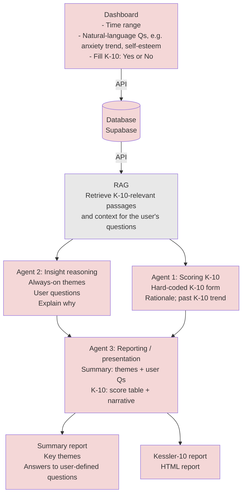

# Journal Analyzer — v2 architecture (tentative)

Top-to-bottom flow matching the product design: **Dashboard → Supabase → RAG → parallel agents → combined reporting → two outputs**.

## Product goals (incremental on v1)

Build **on version 1** rather than replacing it in one shot:

| Area | Aim |
|------|-----|
| **Data** | Connect to a real **database** (e.g. Supabase) for journal entries and structured data (e.g. K-10 history). |
| **AI analysis** | **Respond to the user’s questions** over the selected period and **surface recurring themes** in diary text; keep analysis grounded in retrieved context where possible. |
| **K-10** | **AI-assisted completion** of the K-10 form from journal context, with review/edit in the UI as needed. |
| **Dashboard** | **Updated, sleeker** layout and styling while preserving familiar flows (time range, questions, optional K-10). |

Details and trade-offs can be filled in **step by step** as you specify them.

## Roles (quick reference)

| Block | Responsibility |
|--------|----------------|
| **Dashboard** | Time range, free-text or templated questions (e.g. anxiety trend, self-esteem), optional K-10 intake. |
| **Database** | Persist journal text, embeddings/metadata for RAG, K-10 submissions and history. |
| **RAG** | Fetch relevant chunks for K-10 wording and for user questions over the selected period. |
| **Agent 1** | Score K-10 from structured inputs + journal context; compare to prior K-10; short “why” tied to evidence. |
| **Agent 2** | Thematic insights and answers to user questions with reasoning (can run in parallel with Agent 1 once RAG context is ready). |
| **Agent 3** | Merge outputs: narrative + tables; emit **Summary** markdown/HTML and **K-10** HTML report. |

## Relation to v1

| v1 (current) | v2 direction |
|----------------|--------------|
| `GET /entries` + CSV | Supabase tables + API layer (or Supabase client from app) |
| Trend keywords + single HTML report | RAG retrieval + split **Summary** vs **K-10** reports |
| Ollama in `report_builder` | Same or similar LLM calls inside Agent 1–3 with clearer prompts/contracts |

Use this file as the living diagram for v2; adjust labels and edges as implementation choices land (e.g. whether RAG reads only via API or also edge functions).
