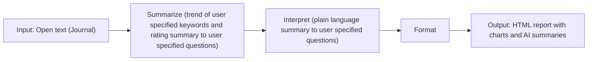

# Journal Analyzer — Report workflow

This diagram describes the high-level flow for report generation. Use it as context for related development.

## Node summary

| Node | Role |
|------|------|
| **A** | Input: open text (journal entries). |
| **B** | Summarize: trends for user-specified phrases and rating/summary for user-specified questions (Ollama). |
| **C** | Interpret: plain-language summary answering user-specified questions (life activity, emotion, observations). |
| **D** | Format: HTML with tables and charts (observations by month/day/time, trend-by-phrase). |
| **E** | Output: HTML report with charts and AI summaries (served via `/reports/{filename}`). |
